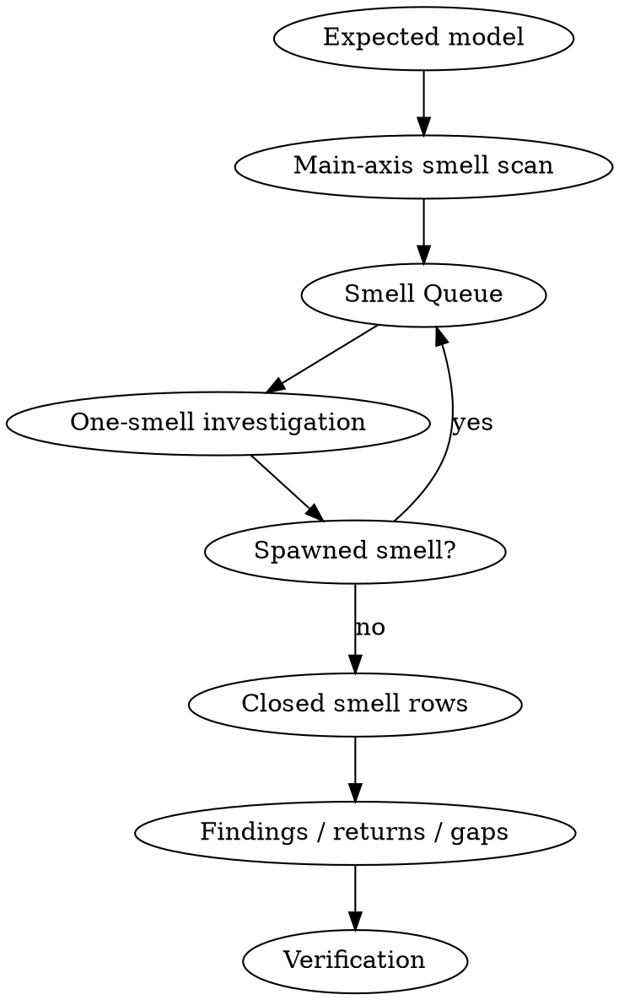

# Review

Review concrete evidence against the expected model. A review finds evidence-backed issues, return-to-modeling triggers, or evidence gaps; it does not redesign. Build/runtime blockers only block executable verification; Independent static model review still runs. Compile blocker is never a positive model signal; Absence of forbidden nouns is not model proof.

First read [../../references/ddd-risk-router.md](../../references/ddd-risk-router.md). For complex lifecycle/repository/event/CQRS scope, also read [../../references/ddd-review-smell-protocol.md](../../references/ddd-review-smell-protocol.md), then load deeper references only for triggered evidence.

## Checklist

1. Reconstruct the expected model from specs, briefs, designs, handoff, code, tests, and runtime evidence.
2. Run a main-axis preflight that compares touched code shape against the correct-shape whitelist and emits deviations into a bounded Smell Queue.
3. Investigate one smell at a time through a non-waiting subagent or bounded local pass.
4. Append and close spawned smells before final output.
5. Generate findings only from terminal negative smell rows.
6. Report verification separately from model review.

## Process Flow



## Expected model sources

Reconstruct the expected model before judging code:

- Domain Modeling Brief, user stories, strategic decisions, and out-of-scope rules;
- DDD design, testing seams, and **Implementation handoff**;
- model evidence for authority, lifecycle, invariant owner, failure tolerance, integration language, collaboration model, and coordination kind when those boundaries matter;
- spec/issue/ADR/glossary/CONTEXT;
- changed files, neighboring code, tests, generated artifacts, migrations, config, runtime wiring, logs, and documented deviations.

If the expected bounded context, data authority, invariant owner, model evidence, layer owner, or local convention cannot be reconstructed, report an evidence gap instead of inventing a model.

## Evidence gate

Before findings:

1. Confirm concrete evidence exists: diff, plan, files, paths, imports, tests, generated artifacts, schema/config/runtime/log evidence, or written deviation.
2. Start from business facts before code shape: Business fact timeline: command -> past-tense fact -> invariant owner -> reaction/process -> consistency/failure tolerance -> repository mechanism. Irreversible fact precedence: durable succeeded/accepted/completed/executed facts outrank open workflow states; delayed projection/reaction is not a retry/cancel window.
3. Classify touched surfaces from evidence: domain abstraction, spec behavior, generated/protocol boundary, persistence, runtime/config, messages/tasks, logging, external adapter, or repo-specific surface.
4. Use the risk router and local convention to choose required proof. The examples are a router, not an inventory.
5. For lifecycle, Repository, or event/reaction risks, require Event Timeline Reconciliation, Recovery reachability proof, terminal lifecycle facts and execution facts separation, and a candidate classification table before Rules Satisfied.
6. Decide each candidate as `Rules Satisfied / Not Applicable / Return to domain-modeling / Return to design / Evidence gap`. Return to domain-modeling cannot be classified as Rules Satisfied.
7. Evidence gap, not finding: missing proof stays a gap unless concrete evidence shows a violation.

## Coverage pass

Coverage pass is the orchestration checklist; detailed risk rules live in the risk router and core reference.
For lifecycle/repository/event/CQRS scope, do not start with Findings.
First emit the exact lifecycle sections from the output contract, including Output completion gate and Checked row admission control.
Lifecycle/repository/event/CQRS scope is a final-output gate, not only a checked/Rules Satisfied gate.
Mandatory-axis completion preflight: final findings are prohibited until every triggered lifecycle, repository/API, collaboration, parent-state, terminal/execution, recovery, event-timeline, and CQRS axis has an emitted ledger.
A mandatory axis may not be omitted. Absence of a ledger becomes a missing-axis evidence-gap ledger. Missing axis ledgers block same-scope positive claims, not final artifact emission.
Severe findings cannot abbreviate mandatory axes; continue inventories after Blocker or Critical findings.
One-row or grouped mandatory sections are incomplete when multiple seeds exist; split rows that cover multiple methods, flows, execution facts, states, ports, commands, or owners.
Inventory seeds: lifecycle flows, repository/API methods, collaboration trigger facts, terminal execution facts, parent state vocabulary, domain event names, and read-shaped write-side methods/shared adapters.
Mandatory proof sections are table-backed gates; prose-only sections, coverage summaries, or broad checked-flow summaries do not count.
Every mandatory proof row needs a stable row id and every checked row must appear in Checked row admission control with the same row id.
Output completion gate marks a section non-empty only when table rows exist and must appear before any checked decision.
Finding paragraphs are generated only from completed inventory rows; pre-written findings cannot replace inventory rows.
Residual positive claims are forbidden when any triggered axis ledger is missing, incomplete, grouped, or skipped.
Forbidden final decisions: scoped OK, no issue found, product reads separated, accepted by design, names look correct, used by commands.
Parallel risk-axis review: run shape-sentinel, lifecycle-spec, and evidence-admission axes independently. One risk axis cannot clear another risk axis.
First-principles shape challenge: after inventory questions and before admitting any tactical shape, ask: Is this shape genuinely necessary for the business invariant, or compensating for a wrong aggregate/lifecycle boundary? If the answer depends on accepted design, transaction shape, semantic names, DTO/package separation, command sequencing, or local convention without explicit model and failure-tolerance proof, keep the default-deny decision.
Rows cover lifecycle facts, event/recovery, aggregate-boundary candidates, terminal/execution facts, CQRS read/write split, FSM API compatibility and state polymorphism, and state-language semantics.
final output must not duplicate final answer blocks.

## Smell queue review protocol

Use [../../references/ddd-review-smell-protocol.md](../../references/ddd-review-smell-protocol.md) for the detailed smell row schema, investigator contract, and risk-card proof reminders.
Main axis emits a bounded Smell Queue before deep investigation. Main-axis preflight compares touched code shape against the correct-shape whitelist; deviations become smell rows. Do not try to enumerate every possible bad smell, and do not write findings in coordinator preflight. Fixed axes are classification tags, not delegation units.
Investigate exactly one smell per subagent or local fallback pass. Subagents must not each perform a full global review.
Use one subagent per triggered smell only when the runtime can return the smell verdict without wait/collab wait. If non-waiting smell delegation is unavailable, run bounded local investigation one smell at a time.
A spawned smell is appended to the same Smell Queue and must reach a terminal verdict before final output. Finding paragraphs can only be generated from Smell Queue rows with terminal negative verdicts.
Never leave the review at a wait/collab wait state after returned smell verdicts exist; emit final output with missing-smell evidence gaps instead.

Post-review calibration: when the user provides a known issue or scoring set after the initial conclusion, compare it to the original output, reflect why the original review missed or shallowly found each item, and convert repeated misses into generic review rules, risk-router updates, or eval assertions. Do not stop after the first Blocker if other independent flows are in scope; report Independent modeling findings separately from executable verification gaps.

## Default-first key concept check

Tactical drift reading: when structures look awkward, treat them as upstream model pressure before suggesting cleanup. For Aggregate, Repository, Domain Event, Integration Message, Application Port, CQRS read, Bounded Context, and FSM state, state the default rule before local convention. semantic repository methods are evidence, not proof: Aggregate Boundary Conflict returns to `domain-modeling`; implementation transaction shape is not model evidence. Return routing: domain-modeling for aggregate boundary/lifecycle/invariant/fact/BC uncertainty; design for accepted-model placement/CQRS/port/adapter/repository API shape. Accepted design is evidence, not waiver. transaction-shaped evidence cannot satisfy Repository design: never list semantic repository transaction, lifecycle transaction, or cross-table transaction under Rules Satisfied. Rules Satisfied is scoped to one rule; it must not cover aggregate boundary or event-collaboration risk in the same flow. Local convention is evidence to inspect, not a waiver.

## Review axes

Keep axes separate:

- **Domain Abstraction** — terms, identity, lifecycle, invariants, aggregate/policy/service/read-model boundary, events/messages, bounded-context ownership.
- **Spec/Behavior** — user stories, state transitions, exceptions, and out-of-scope behavior versus the plan or diff.
- **Code-level DDD/technology** — dependency direction, generated/protocol isolation, persistence mapping, runtime/config, logging, tests, and local technology rules.

Report each finding under one primary axis. Mention secondary impact only when it changes severity.

## Fix direction ordering

Do not reduce finding count to make every finding fully templated. Every finding needs evidence, guardrail, triage, and impact; follow-up fields are selected by finding type.

- **Model correction** — only for lifecycle, consistency, event-fact, or
  coordination findings; name the invariant owner, lifecycle owner, aggregate
  boundary, failure tolerance, or event fact before mechanisms.
- **Implementation mechanism** — repository, transaction, handler, event, task,
  reconciler, or test mechanism that implements the accepted model.
- **Evidence needed** — for evidence gaps.
- **Test / verification needed** — for missing or insufficient proof.

Do not present repository, port, or transaction shape as a peer alternative to
resolving model ownership.

## Output

Final answer is concise. Do not print the full ledger set by default.
For lifecycle/repository/event/CQRS scope, complete and merge required smell verdicts before the final answer, then cite smell ids in the summary and findings.
For complex lifecycle/repository/event/CQRS scope, Smell Queue appendix is mandatory before Findings.
Smell queue summary may cite only smell ids that appear in the mandatory Smell Queue appendix.
A missing smell appendix row becomes an evidence gap, not an emitted-row claim.
Expand ledger rows only when they justify a finding/evidence gap/return, a no-finding claim, or the user asks.
Smell queue summary is evidence-derived: completed or no-finding tags must cite visible smell ids whose decisions appear in findings, evidence gaps, returns, not-applicable rows, or the smell queue appendix.
Wildcard row families such as RC-*, COL-*, or CQ-* are not proof; cite the concrete rows or report an evidence gap for that axis.
Do not claim CQRS inventory completed or product-read no-finding unless the final artifact shows method-level read-shaped write-side rows and decisions.

```text
DDD review:
- Scope/model evidence:
- Smell Queue: smell_id | code shape | trigger evidence | suspected risk card | investigator | status | verdict | spawned_smells | final decision
- Tag coverage summary: Tag | Smell ids | Negative smell ids | Decision
- Findings:

Finding: <severity> <axis> <title> [smell ids]
- Evidence: <file:line>
- Violated guardrail:
- Triage: <violation | return to domain-modeling | return to design | harmless local style | evidence gap>
- Why it matters:
- Fix direction: <model correction | implementation mechanism | evidence needed | test/verification needed>

- Evidence gaps / returns:
- Verification:
- Residual risk:
- Smell Queue appendix: <mandatory for complex lifecycle/repository/event/CQRS scope; include row-local verdict rows for every triggered smell before Findings>
- Ledger appendix: <mandatory for complex lifecycle/repository/event/CQRS scope; include risk-card proof rows for every negative, no-finding, return, or evidence-gap smell>
```

No DDD findings: say that directly only after the Smell Queue shows every triggered smell closed with row-local proof, then list residual test or evidence gaps. Do not fill a finding template with harmless local style.

Severity is about architectural impact: Blocker for invariant/cross-context/generated/storage/runtime safety breaks; Major for likely boundary drift; Minor for localized maintainability or missing proof; Evidence gap when proof is missing.

Common mistakes: reviewing from grep hits; mixing domain/spec/code axes; treating local naming as a violation; treating modeling-return triggers as satisfied; saying "no issues" without residual test/evidence gaps.
