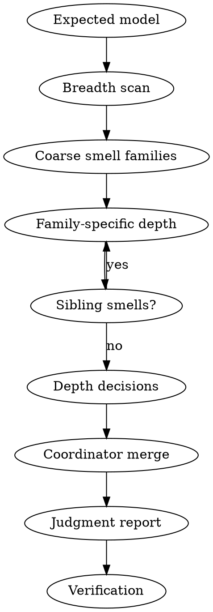

# Review

Review concrete evidence against the expected model. A review finds evidence-backed issues, return-to-modeling triggers, or evidence gaps; it does not redesign. Build/runtime blockers only block executable verification; Independent static model review still runs. Compile blocker is never a positive model signal; Absence of forbidden nouns is not model proof.

First read [../../references/ddd-risk-router.md](../../references/ddd-risk-router.md). For complex lifecycle/repository/event/CQRS scope, also read [../../references/ddd-review-smell-protocol.md](../../references/ddd-review-smell-protocol.md), then load deeper references only for triggered evidence.

## Checklist

1. Reconstruct the expected model from specs, briefs, designs, handoff, code, tests, and runtime evidence.
2. Run breadth first: a thin main-axis scan compares touched code shape against the correct-shape whitelist and emits coarse smell families.
3. Dispatch one depth explainer per coarse smell family; each explainer explains why the presumed-wrong shape is wrong and expands sibling methods, flows, states, events, and ports.
4. Merge returned negative/gap decisions and new issue candidates; do not re-review the whole repo in the coordinator.
5. Generate findings from depth decisions; generate no-finding notes only from positive correct-shape evidence.
6. Report verification separately from model review.

## Process Flow

## Breadth and depth

Breadth is a thin main-axis scan: read the user task, named spec/design/diff seeds, and minimum model evidence needed to identify triggered axes. Breadth emits coarse smell families, not findings and not per-method inventories.

Depth is family-specific root-cause explanation, with axes used only as classification tags. Depth starts from a presumed-wrong smell family, expands sibling methods, flows, states, events, and ports, then explains the chain from business fact to owner, reaction/process, failure tolerance, and implementation mechanism. Each depth pass includes a first-principles shape challenge.

Codex and Claude Code review runtimes are expected to have subagent/task capability. Dispatch one subagent per coarse smell family before coordinator depth analysis. If the runtime exposes no subagent tool, treat that as an environment defect and name it in Depth execution instead of silently falling back.

No-finding decisions require positive correct-shape evidence and apply only outside the Smell Queue. A handed-off smell family returns violation, return, evidence-gap, or spawned-family.

The coordinator merges depth results and new issue candidates. A high-severity finding does not stop other triggered smell-family depth tasks. Final output is judgment-oriented; proof packets are working evidence, not the user-facing report.

## Expected model sources

Reconstruct the expected model before judging code:

- Domain Modeling Brief, user stories, strategic decisions, and out-of-scope rules;
- DDD design, testing seams, and **Implementation handoff**;
- model evidence for authority, lifecycle, invariant owner, failure tolerance, integration language, collaboration model, and coordination kind when those boundaries matter;
- spec/issue/ADR/glossary/CONTEXT;
- changed files, neighboring code, tests, generated artifacts, migrations, config, runtime wiring, logs, and documented deviations.

If the expected bounded context, data authority, invariant owner, model evidence, layer owner, or local convention cannot be reconstructed, report an evidence gap instead of inventing a model.

## Evidence gate

Before findings:

1. Confirm concrete evidence exists: files, paths, imports, tests, generated artifacts, schema/config/runtime/log evidence, or written deviation.
2. Start from business facts before code mechanics: command -> past-tense fact -> invariant owner -> reaction/process -> failure tolerance -> implementation mechanism.
3. Compare touched code against the correct-shape whitelist; missing required shape or present forbidden shape becomes a smell.
4. Use the risk router only to choose depth, not to enumerate findings.
5. Missing proof is an evidence gap unless concrete evidence proves a violation.

## Coverage pass

Coverage pass is the breadth/depth orchestration checklist; detailed risk rules live in the risk router and core reference.
For lifecycle/repository/event/CQRS scope, do not start with Findings; start with breadth scan.
Lifecycle/repository/event/CQRS names are tags for smell-family depth, not broad-axis delegation.
Missing depth results for a triggered smell family become evidence gaps, not positive coverage claims.
Depth explainers expand coarse families into sibling methods, flows, execution facts, parent states, domain events, and read-shaped ports when those siblings share the same whitelist deviation.
No-finding decisions outside the Smell Queue require observed positive shape, not absence of forbidden nouns, DTO/package separation, semantic names, or untriggered grep results.
Finding paragraphs are generated from negative or gap depth decisions.
Final report leads with judgment, not working evidence dumps.
First-principles shape challenge: is this shape genuinely required by the business invariant, or compensating for a wrong aggregate, lifecycle, or boundary?

## Smell queue review protocol

Use [../../references/ddd-review-smell-protocol.md](../../references/ddd-review-smell-protocol.md) for the correct-shape whitelist and smell-queue protocol.
Main axis emits a bounded Smell Queue before deep investigation. Main-axis preflight compares touched code shape against the correct-shape whitelist; deviations become smell rows. Breadth emits coarse smell families; depth expands the family and checks sibling shapes. Do not try to enumerate every possible bad smell, and do not write findings in coordinator preflight. Fixed axes are classification tags, not delegation units.
Main-axis first-hop breadth must enqueue visible layer-triggered smells directly: domain state/event vocabulary, application durable-fact admission/recovery, repository/API candidate-owner/collaboration, CQRS read-shaped write methods, and interface/runtime reachability.
A smell is a failed whitelist match, not a neutral question. Depth starts from wrong shape and explains why it is wrong: model boundary, design placement, implementation drift, evidence gap, or weak trigger evidence.
Do not debate whether a smell might be allowed as a local corner case. If a shape needs an exception, return to modeling or design instead of acquitting it in review.
Repository/API touching non-aggregate roots or multiple aggregate roots is wrong shape. Application code reading entity state to decide domain behavior is wrong shape.
Explain exactly one smell family per subagent. Subagents must not each perform a full global review.
Dispatch one subagent per coarse smell family. The subagent owns the why-wrong explanation for that family, expands sibling methods/flows/states/events/ports, and returns root-cause verdicts plus spawned smell families.
A spawned smell is appended to the same Smell Queue and must reach a terminal verdict before final output. Finding paragraphs can only be generated from negative or gap depth decisions.
Never leave the review at a wait/collab wait state after returned smell verdicts exist; emit final output with missing-smell evidence gaps instead.

Post-review calibration: when the user provides a known issue or scoring set after the initial conclusion, compare it to the original output, reflect why the original review missed or shallowly found each item, and convert repeated misses into generic review rules, risk-router updates, or eval assertions. Do not stop after the first Blocker if other independent flows are in scope; report Independent modeling findings separately from executable verification gaps.

## Default-first key concept check

Tactical drift reading: when structures look awkward, treat them as upstream model pressure before suggesting cleanup. For Aggregate, Repository, Domain Event, Integration Message, Application Port, CQRS read, Bounded Context, and FSM state, state the default rule before local convention. semantic repository methods are evidence, not proof: Aggregate Boundary Conflict returns to `domain-modeling`; implementation transaction shape is not model evidence. Return routing: domain-modeling for aggregate boundary/lifecycle/invariant/fact/BC uncertainty; design for accepted-model placement/CQRS/port/adapter/repository API shape. Accepted design is evidence, not waiver. transaction-shaped evidence cannot satisfy Repository design: never list semantic repository transaction, lifecycle transaction, or cross-table transaction under Rules Satisfied. Rules Satisfied is scoped to one rule; it must not cover aggregate boundary or event-collaboration risk in the same flow. Local convention is evidence to inspect, not a waiver.

## Review axes

Keep axes separate:

- **Domain Abstraction** — terms, identity, lifecycle, invariants, aggregate/policy/service/read-model boundary, events/messages, bounded-context ownership.
- **Spec/Behavior** — user stories, state transitions, exceptions, and out-of-scope behavior versus the plan or diff.
- **Code-level DDD/technology** — dependency direction, generated/protocol isolation, persistence mapping, runtime/config, logging, tests, and local technology rules.

Report each finding under one primary axis. Mention secondary impact only when it changes severity.

## Fix direction ordering

Do not reduce finding count to make every finding fully templated. Every finding needs evidence, guardrail, triage, and impact; follow-up fields are selected by finding type.

- **Model correction** — only for lifecycle, consistency, event-fact, or
  coordination findings; name the invariant owner, lifecycle owner, aggregate
  boundary, failure tolerance, or event fact before mechanisms.
- **Implementation mechanism** — repository, transaction, handler, event, task,
  reconciler, or test mechanism that implements the accepted model.
- **Evidence needed** — for evidence gaps.
- **Test / verification needed** — for missing or insufficient proof.

Do not present repository, port, or transaction shape as a peer alternative to
resolving model ownership.

## Output

Final answer is concise. Do not print the full working-evidence set by default.
For lifecycle/repository/event/CQRS scope, complete and merge required smell verdicts before the final answer, then cite smell families in findings, evidence gaps, or returns.
Working evidence stays internal unless it is needed to understand a judgment. A missing depth decision becomes an evidence gap, not a positive claim.
Every returned smell-family verdict must land in Findings or Evidence gaps / returns.
Do not collapse production wiring, collaboration mechanism, candidate-owner, state vocabulary, or CQRS method-inventory decisions into a broader finding.

Report in this order when present: scope/model evidence, findings, evidence gaps / returns, no-finding notes for non-smell surfaces with positive shape, depth execution, verification, residual risk.

No DDD findings: say that directly only when no concrete violation/return was found; list any smell-family evidence gaps and residual test gaps. Do not fill a finding template with harmless local style.

Severity is about architectural impact: Blocker for invariant/cross-context/generated/storage/runtime safety breaks; Major for likely boundary drift; Minor for localized maintainability or missing proof; Evidence gap when proof is missing.

Common mistakes: reviewing from grep hits; mixing domain/spec/code axes; treating local naming as a violation; treating modeling-return triggers as satisfied; saying "no issues" without residual test/evidence gaps.
