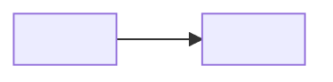

# Context Map

<!-- Remove template comments and placeholders from the written artifact. Create this artifact with the first accepted Bounded Context and retain it when no dependency exists yet. This project uses the ddd-expert House Rule: Context Map dependencies are directional and the complete graph is a DAG. Partnership, Shared Kernel, bidirectional arrows, and dependency cycles are unsupported. -->

## Global View

<!-- Declare every accepted project Bounded Context exactly once, including isolated contexts. Use its lower-kebab-case context slug with hyphens replaced by underscores as the Mermaid identifier, and its accepted context name as the visible label. Add each accepted dependency once as a plain edge from upstream to downstream. This view is a mechanical projection of the Local Views and named contract entries below. -->

Arrow direction: `U -> D` (Upstream model/published-contract influence -> Downstream model). It does not describe runtime call flow.

## Bounded Contexts

### <Upstream Context>

- **Core responsibility:** <Business capability owned by this context>
- **Business authority:** <Facts and decisions for which this context is authoritative>

#### Local View

<!-- List direct neighbors only. Use `- No context dependencies.` for an isolated context. -->

- `<Upstream Context> -> <Downstream Context> [D]`

#### Downstream Contracts

<!-- Repeat once per named contract published across a direct edge. A directional DDD collaboration pattern may be recorded as an optional annotation only after direction and ownership are established. -->

##### <Contract Name>

- **Downstream:** <Downstream Context>
- **Published meaning:** <Upstream facts, decisions, or guarantees exposed in upstream language>
- **Guarantee:** <Authority, ordering, durability, or failure guarantee the upstream owns>

### <Downstream Context>

- **Core responsibility:** <Business capability owned by this context>
- **Business authority:** <Facts and decisions for which this context is authoritative>

#### Local View

- `<Upstream Context> [U] -> <Downstream Context>`

#### Upstream Dependencies

##### <Contract Name>

- **Upstream:** <Upstream Context>
- **Accepted meaning:** <Published meaning this context is allowed to rely on>
- **Local translation:** <How the downstream protects and expresses its local language>
