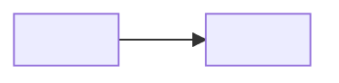

# Context Map

<!-- Remove template comments and placeholders from the written artifact. Create this artifact with the first confirmed Bounded Context. Model dependencies and interactions are separate projections over the same project context inventory. -->

## Global View

<!-- Declare every confirmed project Bounded Context exactly once, including isolated contexts. Give each node a unique lower_snake_case Mermaid identifier and use the confirmed context name as its visible label. The identifier is document syntax and need not duplicate the context directory slug. Add each semantic dependency once as a plain edge from upstream to downstream. -->

Arrow direction: `U -> D` (Upstream model/published-contract influence -> Downstream model). It does not describe runtime call flow.



## Interaction View

<!-- Repeat the exact Global View Bounded Context node declarations. Add each runtime or business interaction between those contexts once as a labeled initiator-to-receiver edge. An interaction may oppose a model dependency or participate in a cycle. Actors, external systems, and purely technical components stay in EventStorming diagrams and never become Interaction-only nodes. When there are no interactions, retain the nodes and no edges. -->

Arrow direction: `initiator -> receiver` (runtime/business interaction). It does not describe model ownership or Context Map dependency.


## Bounded Contexts

### <Upstream Context>

- **Core responsibility:** <Business capability owned by this context>
- **Business authority:** <Facts and decisions for which this context is authoritative>

#### Local View

<!-- Draw one fenced `text` wireframe containing this context and its direct semantic-dependency neighbors only. Dependency arrows point from upstream to downstream, so do not add U/D labels. Connector cells must touch both boxes; do not put spaces around the arrow. Use one connected fan-in/fan-out drawing rather than one relationship per Markdown line; canonical multi-neighbor shapes are in references/ddd-modeling.md. An isolated context is represented by its box alone. Local Views never use Mermaid and never project interactions. -->

```text
+--------------------+   +----------------------+
| <Upstream Context> |-->| <Downstream Context> |
+--------------------+   +----------------------+
```

#### Downstream Contracts

<!-- Repeat once per named semantic contract published across a direct dependency edge. A material directional DDD pattern may be recorded as `- **Collaboration pattern:** <Pattern>` after direction and ownership are established; Partnership and Shared Kernel are unsupported values. -->

##### <Contract Name>

- **Downstream:** <Downstream Context>
- **Published meaning:** <Upstream facts, decisions, or guarantees exposed in upstream language>
- **Guarantee:** <Authority, ordering, durability, or failure guarantee the upstream owns>

### <Downstream Context>

- **Core responsibility:** <Business capability owned by this context>
- **Business authority:** <Facts and decisions for which this context is authoritative>

#### Local View

```text
+--------------------+   +----------------------+
| <Upstream Context> |-->| <Downstream Context> |
+--------------------+   +----------------------+
```

#### Interactions

<!-- This example projects the opposite-direction Interaction View edge initiated by this context. Repeat once for each interaction this context initiates; omit the section when it initiates none. -->

##### <Interaction Name>

- **Receiver:** <Receiving Context>
- **Trigger or intent:** <Business or runtime condition that initiates the interaction>
- **Result or failure feedback:** <Result, rejection, timeout, or recovery meaning visible to the initiator>

#### Upstream Dependencies

##### <Contract Name>

- **Upstream:** <Upstream Context>
- **Accepted meaning:** <Published meaning this context is allowed to rely on>
- **Local translation:** <How the downstream protects and expresses its local language>
