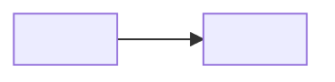

# Context Map

<!-- Remove template comments and placeholders from the written artifact. Create this artifact with the first accepted Bounded Context and retain it even when no relationship exists yet. -->

## Global View

<!-- Declare every accepted project Bounded Context exactly once, including isolated contexts. Use its lower-kebab-case context slug with hyphens replaced by underscores as the Mermaid identifier, and its accepted context name as the visible label. Add only accepted directed relationships between project contexts, using plain unlabeled edges from upstream to downstream. Do not add external contexts or relationships without an accepted upstream/downstream direction. -->

Arrow direction: `U -> D` (Upstream -> Downstream).

## Bounded Contexts

### <Bounded Context>

- **Core responsibility:** <Business capability owned by this context>
- **Business authority:** <Facts and decisions for which this context is authoritative>

## Relationships

<!-- Omit this section until at least one relationship exists. Repeat one subsection per accepted relationship. -->

### <Upstream Context> -> <Downstream Context>

- **Relationship:** <Context Map relationship>
- **Authority boundary:** <Which context owns which facts or decisions>
- **Translation boundary:** <How downstream protects or adopts its local language>
