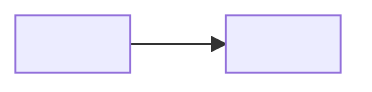

# Context Map

<!-- Remove template comments and placeholders from the written artifact. Create this artifact with the first confirmed Bounded Context. -->

## Global View

<!-- Declare every confirmed project Bounded Context exactly once, including isolated contexts. Give each node a unique lower_snake_case Mermaid identifier and use the confirmed context name as its visible label. The identifier is document syntax and need not duplicate the context directory slug. Add each semantic dependency once as a plain edge from upstream to downstream. -->

Arrow direction: `U -> D` (Upstream model/published-contract influence -> Downstream model). It does not describe runtime call flow.



## Bounded Contexts

### <Upstream Context>

- **Core responsibility:** <Business capability owned by this context>
- **Business authority:** <Facts and decisions for which this context is authoritative>
- **Model:** [<Upstream Context>](context/<upstream-context-slug>/model.md)

#### Local View

<!-- Optional. Include a Local View only when focusing on this context materially improves readability over the Global View. Draw one fenced `text` wireframe containing this context and its direct semantic-dependency neighbors only. Dependency arrows point from upstream to downstream, so do not add U/D labels. Connector cells must touch both boxes; do not put spaces around the arrow. Use one connected fan-in/fan-out drawing rather than one relationship per Markdown line; canonical multi-neighbor shapes are in references/ddd-modeling.md. Local Views never use Mermaid and never project interactions. -->

```text
+--------------------+   +----------------------+
| <Upstream Context> |-->| <Downstream Context> |
+--------------------+   +----------------------+
```

### <Downstream Context>

- **Core responsibility:** <Business capability owned by this context>
- **Business authority:** <Facts and decisions for which this context is authoritative>
- **Model:** [<Downstream Context>](context/<downstream-context-slug>/model.md)

## Model Dependency Contracts

<!-- Describe each named semantic contract exactly once. Its endpoints must match one Global View dependency edge. Repeat this section entry when one dependency carries several distinct contracts. A material directional DDD pattern may be recorded after direction and ownership are established; Partnership and Shared Kernel are unsupported values. -->

### <Contract Name>

- **Upstream:** <Upstream Context>
- **Downstream:** <Downstream Context>
- **Published meaning:** <Upstream facts, decisions, or guarantees exposed in upstream language>
- **Downstream reliance:** <Published meaning the downstream is allowed to rely on>
- **Local translation:** <How the downstream protects and expresses its local language>
- **Guarantee:** <Authority, ordering, durability, or failure guarantee the upstream owns>
