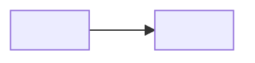

# Context Map

<!-- Remove template comments and placeholders from the written artifact. Create this artifact with the first accepted Bounded Context and retain it when no dependency exists yet. This project uses the ddd-expert House Rule: Context Map dependencies are directional and the complete graph is a DAG. Partnership, Shared Kernel, bidirectional arrows, and dependency cycles are unsupported. -->

## Global View

<!-- Declare every accepted project Bounded Context exactly once, including isolated contexts. Give each node a unique lower_snake_case Mermaid identifier and use the accepted context name as its visible label. The identifier is document syntax and need not duplicate the context directory slug. Add each accepted dependency once as a plain edge from upstream to downstream. This view is a mechanical projection of the Local Views and named contract entries below. -->

Arrow direction: `U -> D` (Upstream model/published-contract influence -> Downstream model). It does not describe runtime call flow.



## Bounded Contexts

### <Upstream Context>

- **Core responsibility:** <Business capability owned by this context>
- **Business authority:** <Facts and decisions for which this context is authoritative>

#### Local View

<!-- Draw one fenced `text` wireframe containing this context and its direct neighbors only. Dependency arrows point from upstream to downstream, so do not add U/D labels. Use one connected fan-in/fan-out drawing rather than one relationship per Markdown line. An isolated context is represented by its box alone. Local Views never use Mermaid. -->

```text
+--------------------+       +----------------------+
| <Upstream Context> | ----> | <Downstream Context> |
+--------------------+       +----------------------+
```

#### Downstream Contracts

<!-- Repeat once per named contract published across a direct edge. After direction and ownership are established, a material directional DDD pattern may be recorded as `- **Collaboration pattern:** <Pattern>`; Partnership and Shared Kernel are unsupported annotation values. Omit the annotation otherwise. -->

##### <Contract Name>

- **Downstream:** <Downstream Context>
- **Published meaning:** <Upstream facts, decisions, or guarantees exposed in upstream language>
- **Guarantee:** <Authority, ordering, durability, or failure guarantee the upstream owns>

### <Downstream Context>

- **Core responsibility:** <Business capability owned by this context>
- **Business authority:** <Facts and decisions for which this context is authoritative>

#### Local View

```text
+--------------------+       +----------------------+
| <Upstream Context> | ----> | <Downstream Context> |
+--------------------+       +----------------------+
```

#### Upstream Dependencies

##### <Contract Name>

- **Upstream:** <Upstream Context>
- **Accepted meaning:** <Published meaning this context is allowed to rely on>
- **Local translation:** <How the downstream protects and expresses its local language>
