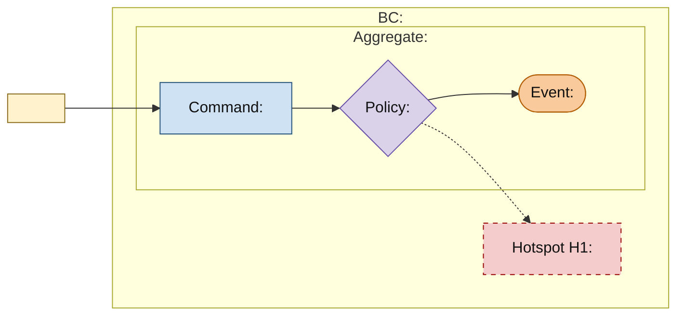

# <EventStorming Scope>

<!-- These minutes are the complete solution for one EventStorming iteration. Keep `status: draft` until the user confirms this exact candidate, use `status: ready` after the affected Models are synchronized, and let Guard set `status: implemented` only after the implementation is clear. Replace every placeholder and remove all template comments. -->

## Scope and Exclusions

<!-- State the business outcome, actors, time horizon, included scenarios, and explicit exclusions. -->

## EventStorming Model

<!-- Persist the complete integrated view discussed with the user. Include actors/external systems, Commands, policies, past-tense Events, supported Aggregate and Bounded Context boundaries, cross-context scenario interactions, and non-blocking Hotspots. -->

## Decisions and Reasons

<!-- Record the material language, authority, lifecycle, Aggregate, Bounded Context, collaboration, and recovery decisions plus the business evidence or trade-off behind each. -->

## Affected Models

<!-- Link every canonical Model whose expected state this iteration changes. -->

- [<Bounded Context>](../context/<context-slug>/model.md)

## Assumptions and Hotspots

<!-- Preserve only assumptions and non-blocking Hotspots that remain relevant to implementing this iteration. -->

| ID | Question or assumption | Why non-blocking |
|---|---|---|
| H1 | <Question or assumption> | <Why implementation can proceed> |
