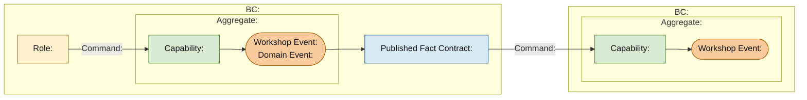

# <EventStorming Scope>

<!-- These minutes are the complete solution for one EventStorming iteration. Keep `status: draft` until the user confirms this exact candidate, use `status: ready` after the affected Models are synchronized, and let Guard set `status: implemented` only after the implementation is clear. Use `status: superseded` plus `superseded_by: "<new-ready-minutes-path>"` only when a later confirmed correction replaces a ready iteration before implementation. Replace every placeholder and remove all template comments. -->

## Scope and Exclusions

<!-- State the business outcome, Bounded Context-local Roles, external authorities, time horizon, included scenarios, and explicit exclusions. -->

## EventStorming Model

<!-- Persist the complete low-resolution business-success paths discussed with the user. Put each business Role inside its Bounded Context and outside every Aggregate. Express each permitted source-to-target Command relationship as one labeled arrow from its initiating Role, selected Domain Event, Published Fact Contract, or external authority to the target Aggregate Capability or explicit coordination; different Roles may use the same normalized Command label and target. Put Root-owned Capabilities inside their Aggregates and connect them to the material past-tense Workshop Events they establish. Omit generic preconditions, decision-rule nodes, permission failures, rejected or unchanged results, and non-blocking Hotspots from this diagram; project confirmed constraints into the affected Model and keep Hotspots in the section below. Include an adverse Workshop Event only when the fact itself changes business rights, obligations, value, or required next action. Connected scenario threads are the single source of truth for the iteration's Workshop Events and Command-to-Capability traceability; do not add parallel event or mapping tables. Unannotated Workshop Events remain analytical. When selected, append `Domain Event: <Canonical past-tense fact>` to the original Workshop Event node. Represent selected cross-context published meaning as a separate producer-owned `Published Fact Contract` node so it remains distinct from the Domain Event and from its eventual Integration Message realization. -->

```mermaid
flowchart LR
    subgraph Upstream["BC: <Upstream Bounded Context>"]
        role["Role: <Initiating business role>"]:::role
        subgraph SourceAggregate["Aggregate: <Source Aggregate Root>"]
            sourceCapability["Capability: <Root-owned operation>"]:::capability
            sourceEvent(["Workshop Event: <Past-tense business fact><br/>Domain Event: <Canonical past-tense fact>"]):::event
        end
        published["Published Fact Contract:<br/><Published contract name>"]:::contract

        role -- "Command: <Business intent>" --> sourceCapability --> sourceEvent --> published
    end

    subgraph Downstream["BC: <Downstream Bounded Context>"]
        subgraph TargetAggregate["Aggregate: <Target Aggregate Root>"]
            targetCapability["Capability: <Target operation>"]:::capability
            targetEvent(["Workshop Event: <Past-tense downstream fact>"]):::event
        end

        targetCapability --> targetEvent
    end

    published -- "Command: <Downstream business intent>" --> targetCapability

    %% For a local-only scenario, omit Downstream and published, and end at sourceEvent.
    %% For an analytical Workshop Event that is not selected as a Domain Event, omit the Domain Event line.
    %% For Application or cross-Aggregate ownership, target a "Coordination: <Business operation>" node outside Aggregate boxes.

    classDef role fill:#fff2cc,stroke:#8a6d1d,color:#111
    classDef external fill:#d9eaf7,stroke:#24527a,color:#111
    classDef contract fill:#d9eaf7,stroke:#24527a,color:#111
    classDef capability fill:#d9ead3,stroke:#38761d,color:#111
    classDef event fill:#f9cb9c,stroke:#b45f06,color:#111
```

## Decisions and Reasons

<!-- Record the material language, authority, lifecycle, Aggregate, Bounded Context, selected Domain Event, published-contract, collaboration, and recovery decisions plus the business evidence or trade-off behind each. -->

## Affected Models

<!-- Link every canonical Model whose expected state this iteration changes. -->

- [<Bounded Context>](../context/<context-slug>/model.md)

## Assumptions and Hotspots

<!-- Preserve only assumptions and non-blocking Hotspots that remain relevant to implementing this iteration. -->

| ID | Question or assumption | Why non-blocking |
|---|---|---|
| H1 | <Question or assumption> | <Why implementation can proceed> |
