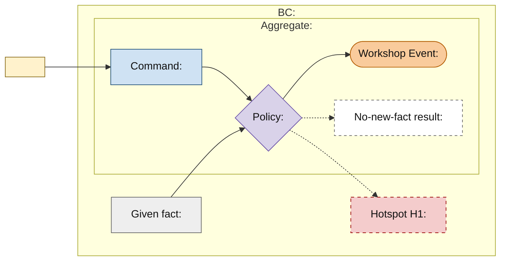

# <EventStorming Scope>

<!-- These minutes are the complete solution for one EventStorming iteration. Keep `status: draft` until the user confirms this exact candidate, use `status: ready` after the affected Models are synchronized, and let Guard set `status: implemented` only after the implementation is clear. Use `status: superseded` plus `superseded_by: "<new-ready-minutes-path>"` only when a later confirmed correction replaces a ready iteration before implementation. Replace every placeholder and remove all template comments. -->

## Scope and Exclusions

<!-- State the business outcome, actors, time horizon, included scenarios, and explicit exclusions. -->

## EventStorming Model

<!-- Persist the complete integrated view discussed with the user. Include actors/external systems, Commands, policies, past-tense Workshop Events, supported Aggregate and Bounded Context boundaries, cross-context scenario interactions, and non-blocking Hotspots. Connected scenario threads are the single source of truth for the iteration's Workshop Events; do not add a parallel manual Event Index. Use the distinct Given fact, Workshop Event, and No-new-fact result labels/styles below. Unannotated Workshop Events remain analytical. When selected, append `Domain Event: <Canonical past-tense fact>` to the original Workshop Event node. Label published cross-context edges `Published Fact Contract: <name>`. -->

```mermaid
flowchart LR
    actor["<Actor>"]:::actor

    subgraph BC["BC: <Bounded Context>"]
        given["Given fact: <Pre-existing authority or state>"]:::given
        subgraph Aggregate["Aggregate: <Aggregate Root>"]
            command["Command: <Business intent>"]:::command
            policy{"Policy: <Decision rule>"}:::policy
            event(["Workshop Event: <Past-tense business fact>"]):::event
            %% Selected form: event(["Workshop Event: <Past-tense business fact><br/>Domain Event: <Canonical past-tense fact>"]):::event
            no_fact["No-new-fact result: <Rejected or unchanged>"]:::result
        end
        hotspot_H1["Hotspot H1: <Non-blocking question>"]:::hotspot
    end

    actor --> command --> policy --> event
    given --> policy
    policy -.-> no_fact
    %% Reaction form: selected_event --> reaction_policy["Reaction Policy: <Why the fact causes the next intent>"] --> next_command["Command: <Next business intent>"]
    %% Cross-context form: event -- "Published Fact Contract: <name>" --> downstream_context
    policy -.-> hotspot_H1

    classDef actor fill:#fff2cc,stroke:#8a6d1d,color:#111
    classDef external fill:#d9eaf7,stroke:#24527a,color:#111
    classDef command fill:#cfe2f3,stroke:#24527a,color:#111
    classDef policy fill:#d9d2e9,stroke:#674ea7,color:#111
    classDef event fill:#f9cb9c,stroke:#b45f06,color:#111
    classDef given fill:#eeeeee,stroke:#666666,color:#111
    classDef result fill:#ffffff,stroke:#666666,color:#111,stroke-dasharray: 4 4
    classDef hotspot fill:#f4cccc,stroke:#990000,color:#111,stroke-dasharray: 5 5
```

## Aggregate Capabilities

<!-- This table is the exact capability projection included in Integrated Model Confirmation. Include one row for every supported Aggregate Root capability in scope and project the confirmed rows into each affected current Model. Do not prescribe code signatures or orchestration. If the scope supports no Aggregate, write the evidence-based no-Aggregate conclusion instead. -->

| Bounded Context | Aggregate Root | Capability | Business intent | Required facts | State transition or outcome | Rejection or failure |
|---|---|---|---|---|---|---|
| <Bounded Context> | <Aggregate Root> | <Business capability> | <Why invoked> | <Authoritative facts> | <Accepted result> | <Rejected/unchanged result> |

## Required Reactions

<!-- Omit this section when the confirmed Model requires no reaction from a selected Domain Event or Published Fact Contract. Include only business-required causality being projected into the reacting Model; keep complete scenario flow in the diagram and implementation mechanisms out. -->

| Reacting Bounded Context | Observed Domain Event or Published Fact Contract | Reaction Policy | Owner | Issued Command | Target Aggregate Capability or coordination | Business failure or recovery |
|---|---|---|---|---|---|---|
| <Bounded Context> | <Fact or contract name> | <Why the fact requires the next intent> | <Policy, Process, or other semantic owner> | <Business intent> | <Capability or explicit coordination> | <Failure, duplicate, or recovery meaning> |

## Decisions and Reasons

<!-- Record the material language, authority, lifecycle, Aggregate, Bounded Context, selected Domain Event, published-contract, collaboration, and recovery decisions plus the business evidence or trade-off behind each. -->

## Affected Models

<!-- Link every canonical Model whose expected state this iteration changes. -->

- [<Bounded Context>](../context/<context-slug>/model.md)

## Assumptions and Hotspots

<!-- Preserve only assumptions and non-blocking Hotspots that remain relevant to implementing this iteration. -->

| ID | Question or assumption | Why non-blocking |
|---|---|---|
| H1 | <Question or assumption> | <Why implementation can proceed> |
