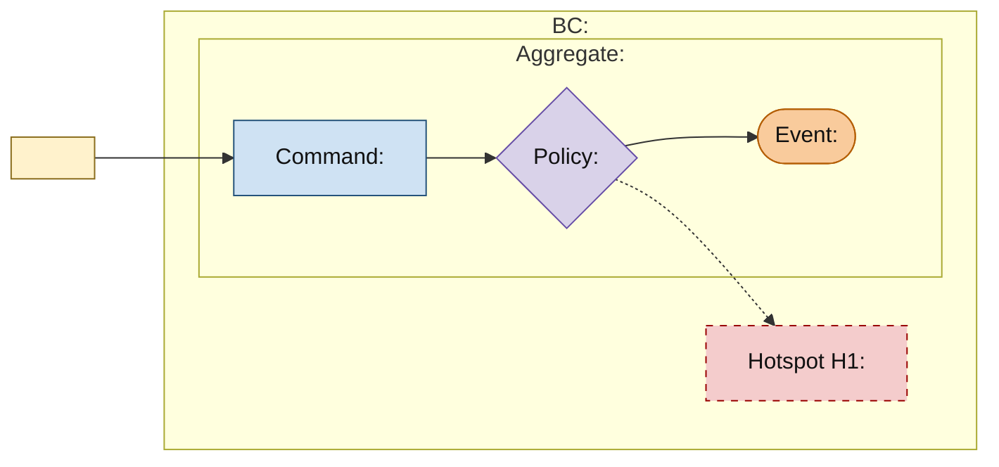

# <Bounded Context> Domain Model

<!-- This artifact is the complete EventStorming approval candidate for one Bounded Context. Use model_status: draft before confirmation and promote the exact approved revision to model_ready. Copy the exact EventStorming source, replace every placeholder, remove all template comments, and retain the canonical section order. -->

## EventStorming Model

<!-- Persist the exact complete section shown in the integrated model. Include actor/external system, Commands, policies, past-tense Events, non-blocking Hotspots, every supported Aggregate boundary, and the Bounded Context boundary. At Bounded Context scope with no supported Aggregate, omit the Aggregate subgraph and use the explicit evidence-based marker in the Aggregates section. Add diagrams only when readability requires Aggregate detail views plus a Bounded Context panorama. -->

## Ubiquitous Language

<!-- Define material terms in this context's own business language. Distinguish translated external terms. -->

## Authority and Ownership

<!-- State who proposes, decides, confirms, changes, reverses, expires, and publishes material facts. -->

## Aggregates and Core Business Objects

<!-- State each confirmed Aggregate boundary/root and the identity, lifecycle, invariant, or concurrency reason that requires it. For each material core object, record the Domain facts Codify needs to choose its tactical form: business meaning, identity and continuity when present, ownership, lifecycle, validity, equality, normalization or units, and references to other Aggregates by identity when material. Do not prescribe fields, classes, accessors, or storage mapping. If Bounded Context scope supports none, write exactly `- **No supported Aggregate:** <evidence-based reason>` instead of inventing a root. -->

## Scenarios and Lifecycle

<!-- Narrate material Commands, past-tense facts, reactions, changed rights/obligations/value, and terminal conditions in business time. When a scenario crosses Aggregates or an external authority, state its trigger, business progress that must survive interruption, reactions, and completion or termination meaning. Preserve those semantic obligations without prescribing a Process Manager, message topology, transaction, or runtime mechanism. -->

## Invariants and Policies

<!-- State immediate consistency rules, decision policies, timing rules, their required facts, semantic owner, and business outcome. -->

## Failure and Recovery Semantics

<!-- State duplicate, cancellation, expiry, retry, compensation, and recovery meaning when material. -->

## Hotspots and Open Questions

<!-- Record the non-blocking Hotspots and assumptions that remained visible when the user confirmed the model. Resolved questions belong in the model decisions they produced, not in a conversation log. If this Model has none, omit every Hotspot node and write only `- None for the confirmed scope.` -->

| ID | Question | Why non-blocking |
|---|---|---|
| H1 | <Question> | <Why the confirmed model does not depend on its answer> |

## Context Dependencies

<!-- Required when this context participates in a Context Map dependency; otherwise omit it. For each named contract, record this context's upstream or downstream role, published meaning, permitted downstream reliance, local translation, and the upstream-owned authority, ordering, durability, or failure guarantee when material. Cross-context scenario interactions remain visible in the EventStorming diagram when they matter to this model; do not turn runtime call direction into a semantic dependency. -->
