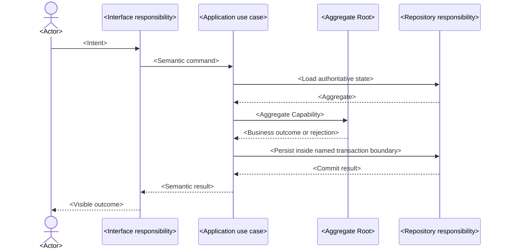

# <Design Delta> Tactical Design

<!-- One record owns one material Design Delta for an implementation slice. Keep `status: draft` until the user confirms this exact candidate, use `status: ready` for Codify authority, and let Guard set `status: implemented` only with the paired iteration closure. Use `status: superseded` plus `superseded_by: "<replacement-ready-tactical-design-or-newer-ready-minutes-path>"` only when newer confirmed business authority invalidates this ready record before implementation. Replace every placeholder and remove all comments. -->

## Scope and Authority

<!-- State the Design Delta and explicit exclusions. Link every governing ready EventStorming record, affected canonical Model, ADR, Spec, PRD, or other accepted project constraint. -->

## Critical Collaboration Sequences

<!-- Include one complete sequence per materially different success, rejection, failure, timeout, retry, or recovery path. Show responsibility participants, Aggregate Capability calls, authoritative reads/writes, transaction boundary, state/checkpoint changes, event publication timing, and visible outcome. Do not use code-level method signatures unless an accepted public contract itself is authority. -->

## Ownership and Changed Interfaces

<!-- Name transaction, state, concurrency, event publication, failure, and recovery ownership. List only changed semantic Interfaces or seams and connect Aggregate calls to accepted Aggregate Capabilities. -->

## Tactical Design Claims

<!-- Keep stable IDs once ready. Keep each ID equal to its explicit HTML anchor so canonical claim keys remain navigable. Each row is one independently falsifiable semantic owner, boundary, ordering, or atomicity assertion. Do not create rows per arrow, file, method, or layer. -->

| Claim ID | Responsibility | Accepted assertion |
|---|---|---|
| TD-001 | <Domain/Application/Interface/Infrastructure/Runtime/Collaboration> | <Implementation-shaping assertion> |

## BC Architecture Projection

<!-- Omit this section when no accepted claim must survive as a current BC-specific architecture decision. Project only durable decisions, once, to the context that owns each responsibility. Use `add`, `replace`, or `remove`; do not copy sequences or rationale. -->

| Bounded Context | Action | Decision ID | Current BC-specific architecture decision | Source claim |
|---|---|---|---|---|
| <Bounded Context> | <add/replace/remove> | ARCH-001 | <One lasting decision, or `—` for remove> | [TD-001](#TD-001) |

## Non-Goals

<!-- State plausible but excluded mechanisms, flows, and architecture changes. -->

## Codify Discretion

<!-- State reversible implementation choices Codify may make inside the accepted seams. -->

## Decisions and Reasons

<!-- Record the chosen collaboration design, strongest credible alternative, decisive constraints, and any ADR update. -->
