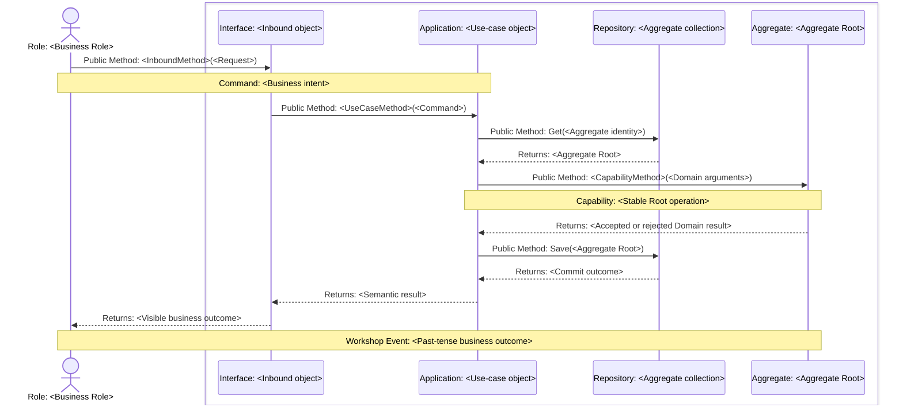

# <Design Delta> Tactical Design

<!-- One record owns one material Design Delta for an implementation slice. Keep `status: draft` until the user confirms this exact candidate, use `status: ready` for Codify authority, and let Guard set `status: implemented` only with the paired iteration closure. Use `status: superseded` plus `superseded_by: "<replacement-ready-tactical-design-or-newer-ready-minutes-path>"` only when newer confirmed business authority invalidates this ready record before implementation. Replace every placeholder and remove all comments. -->

## Scope and Authority

<!-- State the Design Delta and explicit exclusions. Link every governing ready EventStorming record, affected canonical Model, ADR, Spec, PRD, or other accepted project constraint. -->

## Critical Collaboration Sequences

<!--
These typed sequence diagrams are the only persisted Model-to-design projection; add no parallel mapping table. Include one complete sequence per materially different success, rejection, failure, timeout, retry, or recovery path. A separate diagram is justified only by different responsibility, guarantee, durable state/checkpoint, or visible outcome; combine mechanically equivalent variants in one `alt` branch or note and use the fewest readable scenario-focused diagrams.

Group every technical object owned by the same Bounded Context in one Mermaid `box ... end`, repeating one box per represented context. Keep business Roles, external authorities, and external systems without a modeled owning context outside the object boxes. Label every invocation into or between technical participants `Public Method: <receiver method>(<semantic inputs>)`; label replies `Returns: <semantic result>`. Public Method means the receiver-visible callable seam, not a public network API or a final language signature.

Put exact accepted `Role:`, `External Authority:`, `Command:`, `Aggregate:`, `Capability:`, `Domain Event:`, `Published Fact Contract:`, `Integration Message:`, `Coordination:`, and `Workshop Event:` meaning in participant labels or adjacent traceability notes. Preserve the Domain Event -> producer translation -> Integration Message -> consumer translation -> event-triggered Command chain with adjacent notes on its Public Method calls when published meaning crosses a Bounded Context. Show an analytical Workshop Event only as an outcome note; it does not become a software participant, message, or event type. Reuse the same Capability across state variants; trace any additional Domain call to that Capability or an accepted Model policy. Show authoritative reads/writes, transaction boundary, state/checkpoint changes, event publication timing, and visible outcome.
-->

## Ownership and Changed Interfaces

<!-- Name transaction, state, concurrency, event publication, failure, and recovery ownership. List only changed semantic Interfaces or seams and connect each responsibility to the exact typed Model meaning shown in the sequences. Keep Role authorization, Domain Event recording, Published Fact translation, Integration Message adaptation, event-triggered Commands, and Aggregate Capability ownership distinct when present. -->

## Tactical Design Claims

<!-- Keep stable IDs once ready. Keep each ID equal to its explicit HTML anchor so canonical claim keys remain navigable. Each row is one independently falsifiable semantic owner, boundary, ordering, or atomicity assertion. Do not create rows per arrow, file, method, or layer. -->

| Claim ID | Responsibility | Accepted assertion |
|---|---|---|
| TD-001 | <Domain/Application/Interface/Infrastructure/Runtime/Collaboration> | <Implementation-shaping assertion> |

## BC Architecture Projection

<!-- Each Tactical Design Claim appears exactly once in this ledger. Use `projected` for a durable decision, once, in the Bounded Context that owns the responsibility; supply its `add`, `replace`, or `remove` action, local decision ID, and exact current statement. `iteration-only` requires a concrete reason that the claim imposes no surviving BC-specific constraint; use `—` for its Bounded Context, action, and decision ID. No Architecture write occurs only when every row is `iteration-only`; a `remove` may delete the optional file when its final current row is removed. Do not copy sequences or rationale. -->

| Source claim | Disposition | Bounded Context | Action | Decision ID | Current BC-specific architecture decision or iteration-only reason |
|---|---|---|---|---|---|
| [TD-001](#TD-001) | <projected/iteration-only> | <Bounded Context or `—`> | <add/replace/remove or `—`> | <ARCH-001 or `—`> | <One lasting decision, `—` for remove, or concrete iteration-only reason> |

## Non-Goals

<!-- State plausible but excluded mechanisms, flows, and architecture changes. -->

## Codify Discretion

<!-- State reversible implementation choices Codify may make inside the accepted seams. -->

## Decisions and Reasons

<!-- Record the chosen collaboration design, strongest credible alternative, decisive constraints, and any ADR update. -->
