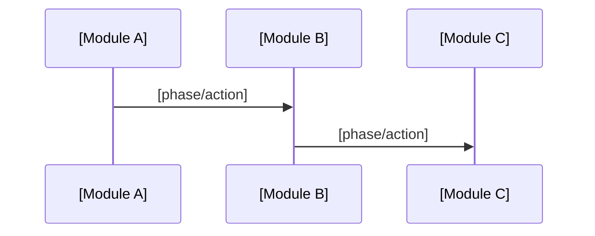

<!-- OWNER: One named cross-service scenario or stable flow family.

     Use this template for `architecture-<scenario>.md` shards when an
     end-to-end chain spans multiple modules/services. Do not scatter the full
     chain across module shards; link participating modules instead.

     TARGET: direct answers for participants, phases, authority boundaries,
     data/control flow, ordering/idempotency/failure rules, module refs, and
     source refs. -->

# Architecture: [Named Scenario / Flow]

## Purpose

[What durable user/system outcome this cross-service scenario exists to achieve.]

## Participants

- **[Module / service]:** [role in this scenario]
- **[Module / service]:** [role in this scenario]

## Sequence Phases

## Authority Boundaries

- **[Module / service]:** [state, decision, or contract it owns in this scenario]
- **[Module / service]:** [what it adapts or observes but does not own]

## Data / Control Flow

- [commands, events, storage writes, message append/publish, fanout, replay, projections, or external calls]

## Ordering / Idempotency / Failure Rules

- **Ordering:** [append-before-publish, replay-before-live, causal order, or sequencing rule]
- **Idempotency:** [dedupe key, attempt fence, retry safety, or exactly/at-least-once boundary]
- **Failure:** [retry, compensation, timeout, stale event, partial failure, or recovery rule]

## Module refs

- [architecture-<module>.md](architecture-<module>.md) — [module responsibility used by this scenario]

## Source refs

- `path/to/design-or-source`
- `path/to/canonical-code`
