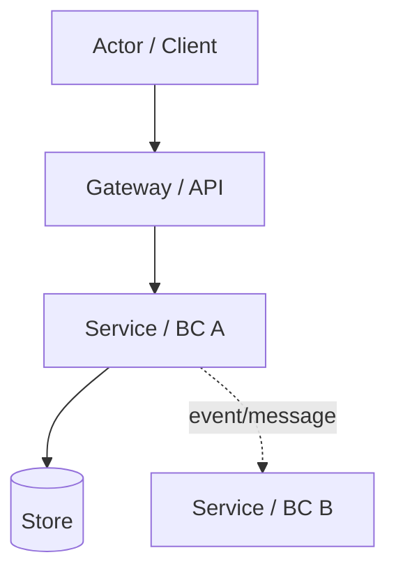
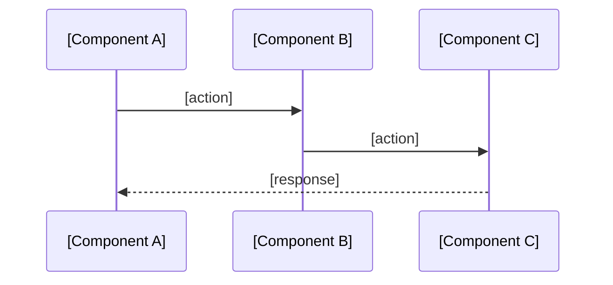
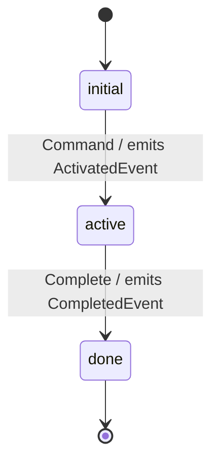

<!-- OWNER: Structure view — how modules are wired, how they interact over time, how core aggregates transition.

     BOUNDARY vs other KB files:
     - features.md: WHAT the system can do (user-visible capabilities). If you're describing behavior from the outside, it belongs there.
     - decisions.md + adr/: WHY it was decided this way. Reference by ADR number only here; never expand rationale inline.
     - tech-stack.md: which libs/tools + versions + pick rationale. Implementation constants (ports, timeouts, TTLs) go there, NOT here.
     - glossary.md: domain term business definitions. Use term names only here.
     - conventions.md: project-wide coding/workflow rules. Env var names, Redis key templates, HTTP header conventions go there, NOT here.

     CONTENT EXCLUSION (specific to architecture.md):
     - Implementation constants: port numbers, timeout values, keepalive settings, TTLs → tech-stack.md or code
     - Env var names, Redis key templates, HTTP header names → conventions.md or glossary.md
     - FSM state names as prose lists ("states: a / b / c / d") → render as Mermaid stateDiagram instead
     - Struct/class field lists, method signatures, enum value catalogs → read from code
     - Capability descriptions (what each component does for a user) → features.md
     - Single-module implementation details → code comments or design docs

     CORE QUERY COVERAGE:
     For high-value bounded contexts, services, major modules, product capabilities,
     or cross-service flows, make one architecture owner entry or shard directly
     answer responsibility, internal layers/main components, upstream/downstream
     interactions, key state/flow/invariants, and source refs.
     When design docs define architecture planes, subsystems, workflows,
     processors, policies, gates, projections, or named runtime components,
     capture those names instead of only listing generic code layers.
     Do not add this depth for every package or helper.

     ARCHITECTURE COVERAGE CALIBRATION:
     For complex engineering repos (3+ services/entry points, DDD/CQRS,
     async flows, runtime orchestration, plugin/runtime extension points, or
     many ADRs), architecture must be a query-grade map:
     - system topology / context map
     - module-first service/BC/main-module shards or compact cards
     - named scenario shards or sections for core cross-service flows
     - lifecycle/FSM coverage for cross-context state
     - source refs for every card and local Source refs after each scenario diagram

     SPLIT RULE:
     - architecture.md is the overview/router.
     - Use architecture-<module>.md for one high-value service, bounded context,
       or main module: architecture-orchestrator.md, architecture-dispatcher.md.
     - Use architecture-<scenario>.md for one named cross-service flow:
       architecture-runtime-message-chain.md, architecture-portal-to-executor.md.
     - Do NOT split by document view or diagram type. architecture-contexts.md
       and architecture-flows.md are legacy view shards; full-refresh should
       migrate durable facts into module and named scenario shards.

     This is NOT a full code tour. Do not document every package, helper,
     method, enum, route, SQL table, or config constant.

     TARGET: ≤200 lines. -->

# Architecture

## Pattern Overview

<!-- Architecture paradigm + 2-3 key characteristics. One paragraph. Elevator pitch for a reader coming in cold. -->

**Overall:** [Pattern name: e.g., "DDD + Bounded Context + event-driven", "Layered API", "Full-stack MVC"]

**Key Characteristics:**
- [e.g., "Vertical slicing by bounded context; cross-BC communication via Kafka events"]
- [e.g., "Stateless request handling; state lives in aggregates"]
- [e.g., "Monorepo; one Go module; one TypeScript pnpm workspace"]

## System Context

<!-- External actors + external systems. The outside-the-trust-boundary view.
     List form, ≤10 lines. Enumerate, don't narrate. -->

**Actors:**
- [e.g., "Internal developers (CLI + Portal)"]
- [e.g., "Operators (kubectl / ops dashboards)"]

**External Systems:**
- [e.g., "MySQL — primary datastore for Supervisor + Sandbox"]
- [e.g., "Kafka — cross-BC event bus"]
- [e.g., "Kubernetes — deployment target + workload runtime"]

## System Topology / Context Map

<!-- Static system map: services, bounded contexts, runtime substrates, stores,
     buses, trust boundaries, and call/event direction rules.

     For small single-deployable projects, a short bullet list is enough.
     For multi-service repos, prefer a Mermaid graph or table.
     State call direction rules at the end.
     DO NOT duplicate capability descriptions that belong in features.md. -->



**Call direction rules:**
- [e.g., "Upper layers call lower directly (ConnectRPC); lower layers publish events, never call back"]
- [e.g., "Within a BC, Domain has no storage/transport/framework imports"]

## Module Architecture Cards

<!-- Conditional but expected for complex repos.

     For each high-value service/bounded context/main module:
     - responsibility and explicit non-responsibility
     - path/entry
     - internal layers/main components (names only; no method signatures or field lists)
       Prefer design-doc planes/subsystems/workflows/processors/projections over
       bare `domain/application/infrastructure` directory labels when available.
     - upstream/downstream interactions
     - owned state/read models/invariants
     - source refs

     GRANULARITY RULE:
     - Use cards only for high-value services/BCs/modules, not every package.
     - Split to `architecture-<module>.md` when a module's internal architecture,
       planes, policies, workflows, processors, read models, or invariants need
       direct query-grade explanation.
     - Link module shards from index.md and this section.
     - A compact card should usually fit in 6-9 short lines. -->

#### [Service / Bounded Context Name]
**Responsibility:** [what it owns; include "does not own ..." when that prevents wrong edits]
**Path / entry:** `path/to/service/` → `path/to/entry`
**Internal layers / components:** [Domain/Application/Infrastructure/read-model/worker/projection names only]
**Interactions:** [upstream/downstream callers, events, APIs, storage, or external systems]
**State / invariants:** [owned state, lifecycle, ordering, idempotency, authorization, or consistency rule]
**Scenario refs:** [named `architecture-<scenario>.md` shards this module participates in, if any]
**Source refs:** [ADR/spec/plan/docs/source paths, or focused `architecture-<module>.md` shard]

## Named Scenario Sequences

<!-- Use See:/Related: links to decisions, features, conventions, and source files when a query reader needs to traverse from structure to rationale or behavior. -->

<!-- Mermaid sequenceDiagram for cross-module scenarios (3+ components).
     Complex repos should cover 4-7 high-value scenarios; small repos can cover 2-3.
     Single-module internal flows do NOT belong here unless they encode a stable
     architectural lifecycle. Prefer scenarios that exercise call direction,
     ownership transfer, async delivery, read-model projection, auth, runtime
     execution, ingest, artifact/file handling, or observability rules.
     Every scenario should include Source refs after the diagram.

     A cross-service feature such as Portal -> Executor runtime delivery should
     NOT be scattered across service shards. Put the complete end-to-end chain in
     a named scenario shard such as architecture-runtime-message-chain.md, then
     link that shard back to the participating module shards. -->

### [Scenario A name]



**Source refs:** [ADR/spec/plan/source paths]

### [Scenario B name]

```mermaid
sequenceDiagram
    ...
```

**Source refs:** [ADR/spec/plan/source paths]

## Key Object FSMs

<!-- Mermaid stateDiagram-v2 for aggregates whose state transitions cross module boundaries
     (typically by emitting cross-BC events that other BCs react to).

     Render as transition diagrams — NOT as bullet lists of state names.
     Label transitions with trigger (incoming command/event) and emitted event where relevant:
       state_a --> state_b: TriggerCommand / emits SomeEvent

     A pure bullet list of state names is an Exclusion List violation — it duplicates what code owns
     without capturing the cross-BC contract that makes the FSM architectural. -->

### [AggregateName] FSM



## Key Design Decisions

<!-- Pointer list only. 3-5 entries.
     Each entry: one-line summary + (ADR-NNN).
     Full rationale lives in decisions.md + adr/ADR-NNN-*.md — do NOT expand here. -->

- **[Decision title]** — see ADR-NNN
- **[Decision title]** — see ADR-NNN
