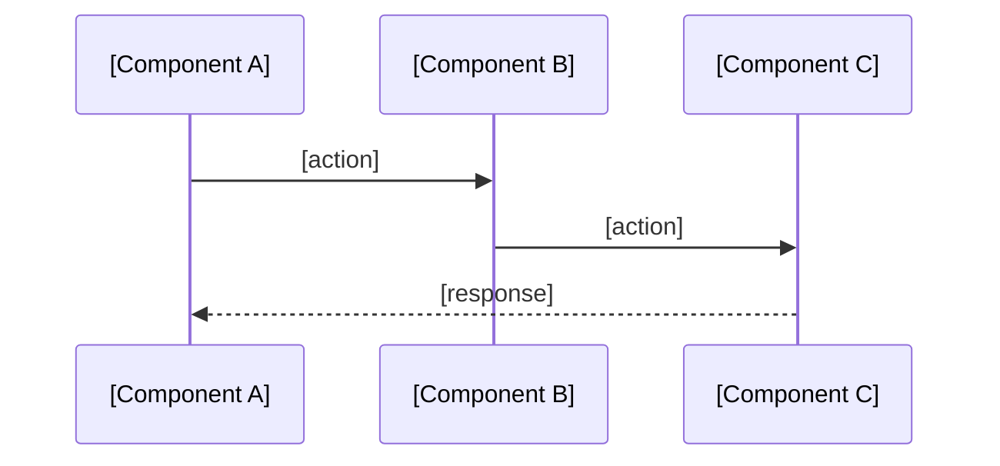
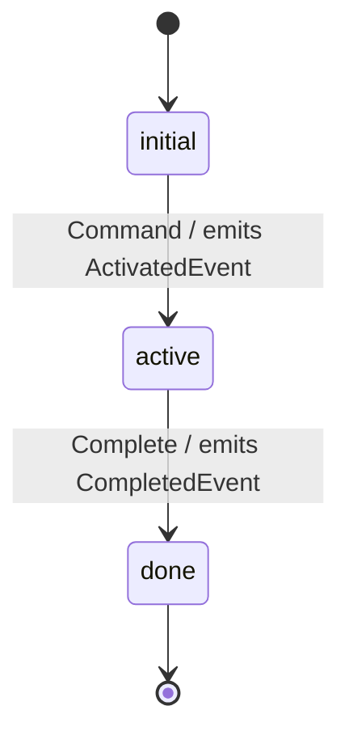

<!-- OWNER: Structure view — how modules are wired, how they interact over time, how core aggregates transition.

     BOUNDARY vs other KB files:
     - features.md: WHAT the system can do (user-visible capabilities). If you're describing behavior from the outside, it belongs there.
     - decisions.md + adr/: WHY it was decided this way. Reference by ADR number only here; never expand rationale inline.
     - tech-stack.md: which libs/tools + versions + pick rationale. Implementation constants (ports, timeouts, TTLs) go there, NOT here.
     - glossary.md: domain term business definitions. Use term names only here.
     - conventions.md: project-wide coding/workflow rules. Env var names, Redis key templates, HTTP header conventions go there, NOT here.

     CONTENT EXCLUSION (specific to architecture.md):
     - Implementation constants: port numbers, timeout values, keepalive settings, TTLs → tech-stack.md or code
     - Env var names, Redis key templates, HTTP header names → conventions.md or glossary.md
     - FSM state names as prose lists ("states: a / b / c / d") → render as Mermaid stateDiagram instead
     - Struct/class field lists, method signatures, enum value catalogs → read from code
     - Capability descriptions (what each component does for a user) → features.md
     - Single-module implementation details → code comments or design docs

     TARGET: ≤200 lines. -->

# Architecture

## Pattern Overview

<!-- Architecture paradigm + 2-3 key characteristics. One paragraph. Elevator pitch for a reader coming in cold. -->

**Overall:** [Pattern name: e.g., "DDD + Bounded Context + event-driven", "Layered API", "Full-stack MVC"]

**Key Characteristics:**
- [e.g., "Vertical slicing by bounded context; cross-BC communication via Kafka events"]
- [e.g., "Stateless request handling; state lives in aggregates"]
- [e.g., "Monorepo; one Go module; one TypeScript pnpm workspace"]

## System Context

<!-- External actors + external systems. The outside-the-trust-boundary view.
     List form, ≤10 lines. Enumerate, don't narrate. -->

**Actors:**
- [e.g., "Internal developers (CLI + Portal)"]
- [e.g., "Operators (kubectl / ops dashboards)"]

**External Systems:**
- [e.g., "MySQL — primary datastore for Supervisor + Sandbox"]
- [e.g., "Kafka — cross-BC event bus"]
- [e.g., "Kubernetes — deployment target + workload runtime"]

## Layering

<!-- Architectural layers or bounded contexts. The static-structure view.

     For each layer/BC:
     - name + one-sentence responsibility
     - location: `path/to/module/`
     - key abstraction names only (aggregate root names, core interface names — no signatures, no field lists)

     State call direction rules at the end (e.g., upper → lower direct; lower → upper via events).
     DO NOT duplicate capability descriptions that belong in features.md. -->

**[Layer / BC Name]** — [one-sentence responsibility]. Location: `path/to/module/`
- Key abstractions: [AggregateRoot names, interface names — names only]

**Call direction rules:**
- [e.g., "Upper layers call lower directly (ConnectRPC); lower layers publish events, never call back"]
- [e.g., "Within a BC, services communicate freely"]

## Scenario Sequences

<!-- 2-3 Mermaid sequenceDiagram for cross-module scenarios (3+ components).
     Single-module internal flows do NOT belong here — they're implementation detail.
     Prefer scenarios that exercise the call direction rules above. -->

### [Scenario A name]



### [Scenario B name]

```mermaid
sequenceDiagram
    ...
```

## Key Object FSMs

<!-- Mermaid stateDiagram-v2 for aggregates whose state transitions cross module boundaries
     (typically by emitting cross-BC events that other BCs react to).

     Render as transition diagrams — NOT as bullet lists of state names.
     Label transitions with trigger (incoming command/event) and emitted event where relevant:
       state_a --> state_b: TriggerCommand / emits SomeEvent

     A pure bullet list of state names is an Exclusion List violation — it duplicates what code owns
     without capturing the cross-BC contract that makes the FSM architectural. -->

### [AggregateName] FSM



## Key Design Decisions

<!-- Pointer list only. 3-5 entries.
     Each entry: one-line summary + (ADR-NNN).
     Full rationale lives in decisions.md + adr/ADR-NNN-*.md — do NOT expand here. -->

- **[Decision title]** — see ADR-NNN
- **[Decision title]** — see ADR-NNN
