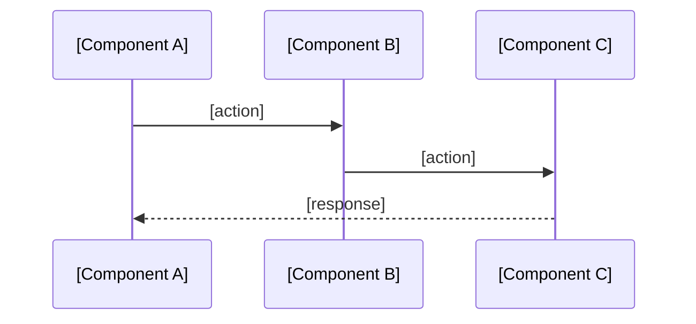

# Project Knowledge Base Optimization Implementation Plan

> **For agentic workers:** REQUIRED SUB-SKILL: Use superpowers:subagent-driven-development (recommended) or superpowers:executing-plans to implement this plan task-by-task. Steps use checkbox (`- [ ]`) syntax for tracking.

**Goal:** Redesign all superpowers-memory templates and skills to fix structural mismatches, eliminate information redundancy, and improve generated knowledge quality.

**Architecture:** Pure Markdown template/skill file changes — 7 templates + 3 skills = 10 files. No executable code. Templates define structure that skills reference when generating knowledge bases.

**Tech Stack:** Markdown, YAML frontmatter, Mermaid diagrams, bash (git commands in skills)

---

### Task 1: Rewrite architecture.md template

**Files:**
- Modify: `plugins/superpowers-memory/templates/architecture.md`

- [ ] **Step 1: Write the new architecture.md template**

Replace the entire file with:

```markdown
---
last_updated: YYYY-MM-DD
updated_by: superpowers-memory:<skill-name>
triggered_by_plan: null
---

<!-- OWNER: System boundaries, module responsibilities, cross-module relationships, data flows.
     Design decision rationale belongs in decisions.md — reference by ADR number only.
     Domain term business definitions belong in glossary.md — use term names only here.

     CONTENT EXCLUSION: Do NOT include information that AI can get by reading 1-2 source files
     and that may change without an architectural decision:
     - Struct/class field lists
     - Enum/constant value mappings (e.g., int8: 0=Skill)
     - Method signatures (unless enforcing non-obvious invariants)
     - Single-module implementation details

     TARGET: ≤200 lines. -->

# Architecture

## Pattern Overview

<!-- Architecture paradigm + 2-3 key characteristics. One paragraph. -->

**Overall:** [Pattern name: e.g., "DDD + Clean Architecture", "Layered API", "Full-stack MVC"]

**Key Characteristics:**
- [e.g., "Vertical slicing by bounded context"]
- [e.g., "Stateless request handling"]

## System Boundaries

<!-- C4 L1: Who/what uses this system? What external services does it depend on?
     List external actors (users, other systems) and external dependencies (databases, APIs). -->

**Actors:**
- [e.g., "Browser client (React SPA)"]
- [e.g., "CI/CD pipeline"]

**External Dependencies:**
- [e.g., "PostgreSQL 15 — primary data store"]
- [e.g., "Redis — session cache"]

## Components

<!-- C4 L2-L3: Core modules/components.
     DDD: Bounded Context list + responsibilities + aggregate root names
     Layered: Layer responsibilities + locations
     Microservices: Service list + responsibilities + communication

     Each component: name, responsibility (1 sentence), location, key abstraction name only.
     Note: location is retained as navigation index, exempt from exclusion rule.
     DO NOT include field lists or method signatures. -->

**[Component/Context Name]** — [One sentence responsibility]. Location: `path/to/module/`
- Key abstractions: [Aggregate root names, core interface names — names only, no signatures]

## Data Flow

<!-- 2-3 core cross-module scenarios using Mermaid sequenceDiagram.
     Only include flows that span 3+ components.
     Single-module internal flows do not belong here. -->



## Key Design Decisions

<!-- 3-5 architectural decisions affecting the whole system.
     Summary only — detailed rationale in decisions.md, reference by ADR number. -->

- **[Decision title]** — [one sentence summary] (ADR-NNN)

## Entry Points [OPTIONAL]

<!-- File paths of main entry points. Only include if project has multiple entry points. ≤10 lines. -->

## Layers [OPTIONAL]

<!-- Layer names + dependency direction. Reference to design pattern docs if applicable. ≤10 lines.
     Example: domain → application → infrastructure (dependency inversion via interfaces) -->

## Error Handling [OPTIONAL]

<!-- System-level error strategy only. Code-level patterns go in conventions.md.
     Example: "Services return domain errors; handlers translate to HTTP status codes" -->

## Cross-Cutting Concerns [OPTIONAL]

<!-- Logging, validation, authentication approaches. Only if project-wide and non-obvious. -->
```

- [ ] **Step 2: Verify the template**

Run: `wc -l plugins/superpowers-memory/templates/architecture.md`
Expected: ~85 lines (well within 200-line target)

Check structure: confirm 5 required sections (Pattern Overview, System Boundaries, Components, Data Flow, Key Design Decisions) + 4 optional sections, each with SSOT ownership comment at top.

- [ ] **Step 3: Commit**

```bash
git add plugins/superpowers-memory/templates/architecture.md
git commit -m "refactor(superpowers-memory): rewrite architecture.md template — universal skeleton + optional sections"
```

---

### Task 2: Rewrite decisions.md template

**Files:**
- Modify: `plugins/superpowers-memory/templates/decisions.md`

- [ ] **Step 1: Write the new decisions.md template**

Replace the entire file with:

```markdown
---
last_updated: YYYY-MM-DD
updated_by: superpowers-memory:<skill-name>
triggered_by_plan: null
---

<!-- OWNER: Design decisions (WHY), known issues, tech debt, security considerations.
     This is the only file that records decision rationale.
     Other files reference by ADR number (e.g., "see ADR-011"), never duplicate content.

     ADR TIERING: Use CRITICAL for decisions with seemingly reasonable but rejected alternatives
     (to prevent AI from re-proposing them). All others use compact 3-line format. -->

# Decisions

## Known Issues

<!-- Living record of known problems. Remove entries when resolved. -->

### Tech Debt

<!-- Format: **[Area]** (`path/to/file`) — description. Fix: approach. -->

### Known Bugs

<!-- Format: **[Bug]** — symptom. Reproduces when: condition. Location: `path/to/file`. -->

### Security Considerations

<!-- Format: **[Risk]** — description. Mitigation: current approach. -->

---

<!-- ADR list below — add new decisions at the top.
     Do not remove old decisions — mark superseded ones instead.

     NORMAL ADR (default — 3 lines):
     ## ADR-NNN: [Decision Title]
     **Decision:** [What was decided, one sentence]
     **Why:** [Why this over alternatives, one sentence]
     **Trade-off:** [Known cost or limitation. None if none]

     CRITICAL ADR (mark [CRITICAL]) — use when rejected alternative looks reasonable
     and AI might re-propose it:
     ## ADR-NNN: [Decision Title] [CRITICAL]
     **Date:** YYYY-MM-DD
     **Status:** Accepted
     **Context:** [What issue motivated this decision]
     **Decision:** [What was decided]
     **Alternatives Considered:**
     - [Alt A]: [why rejected]
     - [Alt B]: [why rejected]
     **Reason:** [Why current approach was chosen]
     **Consequences:** [Positive and negative outcomes, including known risks]

     Mark as CRITICAL when:
     - Security trade-offs (e.g., JWT in query param vs cookie)
     - Architectural exceptions (e.g., deviating from DDD rules)
     - Protocol/format choices with viable alternatives -->
```

- [ ] **Step 2: Verify the template**

Run: `wc -l plugins/superpowers-memory/templates/decisions.md`
Expected: ~50 lines

Check: both Normal and CRITICAL ADR formats are documented in comments with examples.

- [ ] **Step 3: Commit**

```bash
git add plugins/superpowers-memory/templates/decisions.md
git commit -m "refactor(superpowers-memory): rewrite decisions.md template — tiered ADR format"
```

---

### Task 3: Rewrite conventions.md template

**Files:**
- Modify: `plugins/superpowers-memory/templates/conventions.md`

- [ ] **Step 1: Write the new conventions.md template**

Replace the entire file with:

```markdown
---
last_updated: YYYY-MM-DD
updated_by: superpowers-memory:<skill-name>
triggered_by_plan: null
---

<!-- OWNER: Naming conventions, code style, architecture rules, testing conventions, git workflow.
     Architecture Rules here are PROJECT-SPECIFIC constraints only.
     For general DDD/Clean Architecture rules, reference design-pattern documents — do not duplicate.
     System-level error strategy belongs in architecture.md.

     CONTENT EXCLUSION: Do not repeat rules already enforced by formatter/linter.
     Principle: if the formatter handles it, don't repeat it here. -->

# Conventions

## Naming Patterns

**Files:** [e.g., "kebab-case for all files", "PascalCase.tsx for React components"]
**Functions/Methods:** [e.g., "camelCase", "snake_case"]
**Variables/Constants:** [e.g., "camelCase; UPPER_SNAKE_CASE for module-level constants"]
**Types:** [e.g., "PascalCase interfaces and type aliases"]

## Code Style

**Formatter:** [Tool + config file: e.g., "gofmt" or "Prettier, .prettierrc"]
**Linter:** [Tool + config file: e.g., "golangci-lint, .golangci.yml" or "ESLint, eslint.config.js"]
<!-- Only include style rules that DEVIATE from formatter/linter defaults.
     If the formatter handles it, don't repeat it here. -->

## Error Handling

<!-- Code-level patterns: how to write error handling code.
     System-level strategy (which layer catches what) goes in architecture.md. -->

**Strategy:** [e.g., "Throw errors, catch at boundaries" or "Return Result<T,E>"]
**Custom errors:** [e.g., "Extend Error class, named *Error" or "Wrap with fmt.Errorf"]

## Architecture Rules

<!-- Project-specific hard constraints: what is NOT allowed, boundaries that must not be crossed.
     For general DDD/Clean Architecture rules, reference design-pattern docs — do not duplicate here. -->

## Testing Conventions

**Framework & command:** [e.g., "go test ./...", "pytest", "vitest — npm test"]
**Mock principle:**
- Mock: [e.g., "External HTTP calls, databases, time"]
- Do NOT mock: [e.g., "Internal business logic, pure functions"]
**Coverage target:** [e.g., "80% line coverage" or "no formal requirement"]
<!-- Optional: Fixtures location, E2E strategy, performance benchmarks -->

## Git & Workflow

<!-- Branch naming, commit message format, PR process -->

## Domain-Specific Conventions [OPTIONAL]

<!-- Add sections based on project needs. Common examples:
     - Database Standards (table naming, migrations, indexing strategy)
     - API Standards (routing conventions, versioning, response format)
     - Frontend Standards (component patterns, state management)
     - Security Standards (input validation, auth patterns)
     Only add sections with non-obvious, project-specific rules. -->
```

- [ ] **Step 2: Verify the template**

Run: `wc -l plugins/superpowers-memory/templates/conventions.md`
Expected: ~60 lines

Check: no JS/TS-specific sections remain (no Quotes, Semicolons, Import Organization, Path Aliases, Barrel files, JSDoc/TSDoc, Max parameters, Exports).

- [ ] **Step 3: Commit**

```bash
git add plugins/superpowers-memory/templates/conventions.md
git commit -m "refactor(superpowers-memory): rewrite conventions.md template — remove JS/TS specifics, universal skeleton"
```

---

### Task 4: Rewrite features.md template

**Files:**
- Modify: `plugins/superpowers-memory/templates/features.md`

- [ ] **Step 1: Write the new features.md template**

Replace the entire file with:

```markdown
---
last_updated: YYYY-MM-DD
updated_by: superpowers-memory:<skill-name>
triggered_by_plan: null
---

<!-- OWNER: Feature list, implementation status, roadmap.
     "Not yet implemented" items (Redis cache, S3 archival, etc.) belong here, not in tech-stack.md.

     CONTENT EXCLUSION: Only list features that are non-obvious from codebase structure.
     If the feature is evident from a top-level directory name, it doesn't need a separate entry. -->

# Features

## Implemented

<!-- Group by plan/iteration. Each feature: one line + spec/plan link.
     Only list features non-obvious from codebase structure. -->

### [Plan/Iteration Name]
<!-- [spec](../superpowers/specs/xxx.md) | [plan](../superpowers/plans/xxx.md) -->
- [Feature description]

## In Progress

<!-- Features currently being implemented. -->

### [Plan Name]
<!-- [plan](../superpowers/plans/xxx.md) -->
- [Feature description]

## Planned

<!-- Features with specs but not yet started. -->

- [Feature description] — [spec](../superpowers/specs/xxx.md)

<!-- Cleanup rule: During update, AI identifies plans that appear abandoned
     (no corresponding commits, superseded by newer plans) and asks the user
     to confirm removal. Abandoned plans are removed only after user confirmation. -->
```

- [ ] **Step 2: Verify the template**

Run: `wc -l plugins/superpowers-memory/templates/features.md`
Expected: ~35 lines

Check: no table format remains; three stages (Implemented / In Progress / Planned); spec/plan links present.

- [ ] **Step 3: Commit**

```bash
git add plugins/superpowers-memory/templates/features.md
git commit -m "refactor(superpowers-memory): rewrite features.md template — list format, three stages"
```

---

### Task 5: Create glossary.md template

**Files:**
- Create: `plugins/superpowers-memory/templates/glossary.md`

- [ ] **Step 1: Write the new glossary.md template**

```markdown
---
last_updated: YYYY-MM-DD
updated_by: superpowers-memory:<skill-name>
triggered_by_plan: null
---

<!-- OWNER: Domain term definitions (Ubiquitous Language).
     Bounded Context names and aggregate root names APPEAR in architecture.md as component identifiers;
     their BUSINESS MEANING DEFINITIONS belong here.

     Include terms where:
     - The same word means different things in different Bounded Contexts
     - The business meaning is not obvious from the code name
     - The term maps to a specific code construct (type, interface, module)

     DO NOT include:
     - Standard technical terms (REST, gRPC, JWT, WebSocket, etc.)
     - Terms used only within a single module

     TARGET: ≤80 lines. -->

# Glossary

**TermName** — Business definition of the term. → `path/to/code/location`
```

- [ ] **Step 2: Verify the template**

Run: `wc -l plugins/superpowers-memory/templates/glossary.md`
Expected: ~22 lines

Check: definition list format (not table), SSOT ownership comment present, exclusion rules documented.

- [ ] **Step 3: Commit**

```bash
git add plugins/superpowers-memory/templates/glossary.md
git commit -m "feat(superpowers-memory): add glossary.md template for domain terminology"
```

---

### Task 6: Update tech-stack.md and MEMORY.md templates

**Files:**
- Modify: `plugins/superpowers-memory/templates/tech-stack.md`
- Modify: `plugins/superpowers-memory/templates/MEMORY.md`

- [ ] **Step 1: Update tech-stack.md template**

Add SSOT ownership comment and flexible organization note at the top (after frontmatter, before `# Tech Stack`). Keep existing structure but add the comments:

Insert after line 5 (the `---` closing frontmatter):

```markdown

<!-- OWNER: Languages, frameworks, dependencies, version numbers, build tools, infrastructure.
     "Not yet implemented" features (Redis cache, S3, etc.) belong in features.md, not here.

     ORGANIZATION: Use EITHER technology category (Languages / Runtime / Dependencies)
     OR system boundary (Backend / Frontend / Database / Infrastructure).
     Choose whichever fits the project better.
     Core constraint: every technology choice must include version and selection rationale. -->
```

- [ ] **Step 2: Write the new MEMORY.md template**

Replace the entire file with:

```markdown
---
last_updated: YYYY-MM-DD
updated_by: superpowers-memory:<skill-name>
triggered_by_plan: null
---

# Project Knowledge Index

- [architecture.md](architecture.md) — System boundaries, components, data flows
  Key points: [1-2 facts that help AI decide whether to load this file in full.
               Good: "6 bounded contexts; DDD + Clean Architecture"
               Bad: "system architecture information"]

- [tech-stack.md](tech-stack.md) — Languages, frameworks, key dependencies
  Key points: [1-2 decision-relevant facts.
               Good: "Go 1.25 + React 19 + K8s"
               Bad: verbose summaries]

- [features.md](features.md) — Implemented features, in-progress work, roadmap
  Key points: [1-2 facts. Good: "8 plans completed; 2 in progress"]

- [conventions.md](conventions.md) — Coding standards, architecture rules, workflow
  Key points: [1-2 facts. Good: "domain zero deps; gofmt + golangci-lint"]

- [decisions.md](decisions.md) — ADR log (normal + CRITICAL), known issues
  Key points: [1-2 facts. Good: "17 ADRs, 3 CRITICAL"]

- [glossary.md](glossary.md) — Domain terminology (Ubiquitous Language)
  Key points: [1-2 facts. Good: "12 domain terms across 4 contexts"]
```

- [ ] **Step 3: Verify both files**

Run: `wc -l plugins/superpowers-memory/templates/tech-stack.md plugins/superpowers-memory/templates/MEMORY.md`

Check MEMORY.md: includes glossary.md entry, frontmatter uses `null` (not `"none"` or `<plan-filename>`), Key Points guidance shows good/bad examples.

- [ ] **Step 4: Commit**

```bash
git add plugins/superpowers-memory/templates/tech-stack.md plugins/superpowers-memory/templates/MEMORY.md
git commit -m "refactor(superpowers-memory): update tech-stack.md + MEMORY.md templates — SSOT, Key Points, glossary entry"
```

---

### Task 7: Rewrite rebuild SKILL.md

**Files:**
- Modify: `plugins/superpowers-memory/skills/rebuild/SKILL.md`

- [ ] **Step 1: Write the new rebuild SKILL.md**

Replace the entire file with:

```markdown
---
name: rebuild
description: Use when initializing project knowledge for the first time or when knowledge has drifted too far from reality — full codebase scan and knowledge regeneration
---

# Rebuild Project Knowledge

Scan the entire codebase and generate a complete project knowledge base from scratch.

**Announce at start:** "I'm rebuilding the project knowledge base from the codebase."

## When to Use

- First time setting up the knowledge base for a project
- Knowledge base has drifted significantly from reality
- User explicitly requests a full rebuild

## Pre-check

If `docs/project-knowledge/` already exists:
- Read `last_updated` from any knowledge file
- Count significant commits since last update:
  `git log --oneline --since="<last_updated>" -E --grep="^(feat|refactor)" --no-merges | wc -l`
- If < 5 significant commits since last update: warn user
  "Knowledge base was recently updated on [date] with only N feat/refactor
  commits since. Full rebuild will overwrite incremental changes. Continue?"
- Wait for confirmation before proceeding.

## Process

### 1. Phase 1 — General scan

- Read project structure: `ls`, key directories
- Read configuration files: `package.json`, `go.mod`, `Cargo.toml`, `pyproject.toml`, `Makefile`, `docker-compose.yml`, etc.
- Read existing documentation: `README.md`, `CLAUDE.md`, `docs/` directory
- Read existing specs and plans: `docs/superpowers/specs/`, `docs/superpowers/plans/`
- Check git log for recent development history: `git log --oneline -20`

### 2. Phase 2 — Deep scan

Based on Phase 1 findings, identify the project's top-level modules (directories representing independent functional units). For each module:
- Read the core abstraction file (primary types, interfaces, or entry point)
- Read 2-3 cross-module integration points, prioritizing flows that span 3+ components

Prioritize reading:
1. Files referenced in README.md or CLAUDE.md
2. Module entry points / registration files
3. Interface or contract definitions (APIs, events, repository interfaces)

Do NOT read: test files, generated code, vendor/node_modules, migration files, or single-module implementation details.

### 3. Generate knowledge files

Create `docs/project-knowledge/` directory if it doesn't exist.

For each of the 6 knowledge files, use the plugin template as the structural basis and fill in concrete content from the codebase analysis:

- **architecture.md** — System boundaries (external actors + dependencies), components (modules/contexts with responsibilities + locations + key abstraction names), data flows (2-3 Mermaid sequenceDiagrams for core cross-module scenarios), key design decisions (summary + ADR reference). Optional sections (Entry Points, Layers, Error Handling, Cross-Cutting Concerns) only if project has them.
- **tech-stack.md** — Languages and frameworks (from config files), key dependencies (from package manifests), build tools (from scripts/Makefile). Organize by technology category or system boundary — whichever fits better.
- **features.md** — Implemented features grouped by plan/iteration (from specs, README, and code), in-progress features (from plans with unchecked items), planned features (from specs without plans).
- **conventions.md** — Coding standards (from linter configs, existing patterns), architecture rules (project-specific only — do not duplicate general DDD/Clean Architecture rules from design-pattern docs), testing conventions (framework, mock principle, coverage target), git workflow. Add Domain-Specific Conventions (DB, API, frontend standards) only if non-obvious project-specific rules exist.
- **decisions.md** — Extract significant decisions from git history, specs, and code comments. Use Normal 3-line format by default. Use CRITICAL format when the decision has a seemingly reasonable but rejected alternative that AI might re-propose.
- **glossary.md** — Domain terms from Ubiquitous Language: terms where the business meaning is not obvious from the code name, or the same word means different things in different contexts. Use definition list format: `**Term** — Definition. → \`path\``

### 4. Set frontmatter

For every generated file:
- `last_updated`: today's date (YYYY-MM-DD)
- `updated_by`: `superpowers-memory:rebuild`
- `triggered_by_plan`: `null`

### 5. Generate MEMORY.md index

After writing the 6 knowledge files, generate `docs/project-knowledge/MEMORY.md`:

- For each of the 6 files, extract 1-2 key points that help AI decide whether to load the file in full (e.g., specific pattern names, version numbers, counts — not generic descriptions)
- Write the file following the format in `templates/MEMORY.md`, setting `updated_by: superpowers-memory:rebuild` and `triggered_by_plan: null`

**Size constraint:** Keep MEMORY.md under 50 lines total.

### 6. Verify (before commit)

Run these checks against generated content. Fix any issues found before committing.

**6a. Path existence:**
Extract file/directory paths referenced in knowledge files (including code locations in glossary.md). Verify each exists with `ls`. Remove or correct stale paths.

**6b. Version consistency:**
Compare version numbers in tech-stack.md against actual manifests:
- Go: `grep '^go ' go.mod`
- Node: `node -v` or `cat .node-version`
- Key deps: spot-check 2-3 against go.mod / package.json

**6c. Module coverage:**
List actual top-level modules (e.g., `ls internal/` or `ls src/`). Confirm each appears in architecture.md Components section. Flag modules in code but missing from knowledge, or vice versa.

**6d. SSOT spot-check:**
Pick 2-3 concepts appearing in multiple files. Confirm full description only in designated owner file; other files use references only.

### 7. Post-rebuild diff summary

If previous knowledge files existed:
- Output a brief diff summary: which files changed, what was added/removed/modified
- This helps the user verify the rebuild didn't lose important information.

### 8. Commit

```bash
git add docs/project-knowledge/
git commit -m "docs: rebuild project knowledge base from codebase"
```

### 9. Report

- Summarize what was generated
- Note any areas where information was sparse or uncertain
- Suggest running `superpowers-memory:update` after the next iteration to keep knowledge fresh

## Content Rules

**Language:** Generate content in the same language as the project's existing documentation (README, specs, plans, code comments). Section headings remain in English for skill parsing compatibility.

**Inclusion principle:** Only include information that requires crossing module/package boundaries to understand, changes only with architectural decisions, and affects understanding of multiple modules.

**Exclusion list — do NOT include:**
- Struct/class field lists — AI should read source code directly
- Enum/constant value mappings — these change with code and go stale
- Method signatures (unless enforcing non-obvious invariants)
- Single-module implementation details
- Information derivable from `git log` or `git blame`

**SSOT:** Each piece of information has one owner file per the ownership matrix in templates. Full content only in the owner; other files reference by pointer ("see ADR-011").

**Quality:** Be factual (verify from codebase, do not speculate), be concise (scannable in under 2 minutes per file), be structured (follow template format), link to sources (file paths, spec files, plan files).
```

- [ ] **Step 2: Verify the skill**

Run: `wc -l plugins/superpowers-memory/skills/rebuild/SKILL.md`
Expected: ~130 lines

Check key changes:
- Pre-check section exists (B6)
- Phase 1 + Phase 2 scan (B3)
- 6 knowledge files (not 5) — includes glossary.md
- Verify step before commit (B1)
- Post-rebuild diff summary (B6)
- Content Rules section with language rule (A11), exclusion framework (A1), SSOT (A3)
- `triggered_by_plan: null` (not `"none"`) (A10)
- MEMORY.md size constraint: 50 lines (not 30)

- [ ] **Step 3: Commit**

```bash
git add plugins/superpowers-memory/skills/rebuild/SKILL.md
git commit -m "refactor(superpowers-memory): rewrite rebuild skill — two-phase scan, verify step, content rules"
```

---

### Task 8: Rewrite update SKILL.md

**Files:**
- Modify: `plugins/superpowers-memory/skills/update/SKILL.md`

- [ ] **Step 1: Write the new update SKILL.md**

Replace the entire file with:

```markdown
---
name: update
description: Use after completing a development branch or when prompted by Stop hook — incrementally updates project knowledge base from recent changes
---

# Update Project Knowledge

Incrementally update the project knowledge base based on changes from the current iteration.

**Announce at start:** "I'm updating the project knowledge base."

## Prerequisites

- `docs/project-knowledge/` must exist. If not, tell the user to run `superpowers-memory:rebuild` first.

## Process

### 1. Gather context

- Read all 6 current knowledge files from `docs/project-knowledge/`
- Identify the most recent plan file: list `docs/superpowers/plans/` sorted by modification time and pick the most recently modified file. If there are multiple files modified within the last 24 hours or no plan files exist, ask the user which plan triggered this update.
- Read the triggering plan file and its associated spec (from `docs/superpowers/specs/`)
- Determine the base branch: run `git symbolic-ref refs/remotes/origin/HEAD 2>/dev/null | sed 's|refs/remotes/origin/||'` and fall back to `main` if the command fails. Then run `git diff <base-branch>...HEAD --stat` to see what files changed.

### 2. Structural change detection

Check for architecture-level changes beyond `git diff --stat`:

- New or deleted top-level module directories
- Changes to dependency injection / module registration files
- Renamed module directories

**If structural changes detected:**
  Warn: "Structural changes detected (new/deleted modules). Incremental update may be insufficient — consider running superpowers-memory:rebuild for a full rescan."
  If user confirms update: fully refresh architecture.md Components section (not just append).

**If no structural changes:** proceed with normal incremental update.

**Deletion awareness:** Check `git diff <base-branch>...HEAD --diff-filter=D --name-only`. If deleted files/modules are still referenced in knowledge files, remove stale references.

### 3. Analyze what changed

- New features implemented? → update `features.md`
- Architecture changed (new modules, changed data flow)? → update `architecture.md`
- New dependencies added? → update `tech-stack.md`
- New conventions established? → update `conventions.md`
- Significant design decisions made? → add ADR to `decisions.md` (Normal 3-line by default; CRITICAL if the decision has a seemingly reasonable but rejected alternative)
- New domain terms introduced? → update `glossary.md`

### 4. Apply updates

- Only modify files that need changes — do not rewrite unchanged files
- Preserve existing content; append or modify specific sections
- Update frontmatter in every modified file:
  - `last_updated`: today's date (YYYY-MM-DD)
  - `updated_by`: `superpowers-memory:update`
  - `triggered_by_plan`: the plan filename that triggered this update (e.g., `2026-03-31-superpowers-memory.md`); if no plan triggered this update, **preserve the existing value — do not overwrite with `null` or `"none"`**

### 5. Abandoned plan cleanup

Check features.md for plans that appear abandoned (no corresponding commits in recent history, superseded by newer plans). If found, ask the user to confirm removal. Remove only after user confirmation.

### 6. Regenerate MEMORY.md index

Always regenerate `docs/project-knowledge/MEMORY.md` in full (full overwrite — any file's key points may have changed):

- Re-read all 6 knowledge files (including any you just updated)
- Extract 1-2 key points per file that help AI decide whether to load it in full
- Write `docs/project-knowledge/MEMORY.md` following the format in `templates/MEMORY.md`, setting `updated_by: superpowers-memory:update` and `triggered_by_plan: <plan-filename>`

**Size constraint:** Keep MEMORY.md under 50 lines total.

### 7. Verify (before commit)

Run these checks against updated content. Fix any issues found before committing.

**7a. Path existence:**
Extract file/directory paths referenced in knowledge files (including code locations in glossary.md). Verify each exists with `ls`. Remove or correct stale paths.

**7b. Version consistency:**
Compare version numbers in tech-stack.md against actual manifests:
- Go: `grep '^go ' go.mod`
- Node: `node -v` or `cat .node-version`
- Key deps: spot-check 2-3 against go.mod / package.json

**7c. Module coverage:**
List actual top-level modules (e.g., `ls internal/` or `ls src/`). Confirm each appears in architecture.md Components section. Flag modules in code but missing from knowledge, or vice versa.

**7d. SSOT spot-check:**
Pick 2-3 concepts appearing in multiple files. Confirm full description only in designated owner file; other files use references only.

### 8. Size guard

After applying updates, check line counts. If any file exceeds its threshold, warn the user and suggest specific compression actions. Do NOT auto-compress.

| File | Warning threshold |
|------|------------------|
| architecture.md | 200 |
| conventions.md | 150 |
| decisions.md | 150 |
| tech-stack.md | 120 |
| features.md | 100 |
| glossary.md | 80 |
| MEMORY.md | 50 |

Compression suggestions by file type:
- features.md: collapse old completed iterations into one-line summaries
- decisions.md: non-CRITICAL ADRs beyond 10 entries → merge into Historical section
- architecture.md: remove implementation details, keep module-level only
- conventions.md: remove rules already enforced by formatter/linter config
- tech-stack.md: remove deprecated or no-longer-used dependencies
- glossary.md: merge synonymous entries, remove terms only referenced in one file

### 9. Commit

```bash
git add docs/project-knowledge/
git commit -m "docs: update project knowledge base from [plan-name]"
```

### 10. Report changes

- List which knowledge files were updated and what changed
- Confirm MEMORY.md was regenerated
- If no knowledge file updates were needed, still regenerate MEMORY.md

## Templates

Knowledge files follow the structure defined in the plugin templates:

- `architecture.md` → Pattern Overview, System Boundaries, Components, Data Flow (Mermaid), Key Design Decisions, + optional sections
- `tech-stack.md` → Flexible: by technology category or system boundary
- `features.md` → Implemented (plan-grouped lists), In Progress, Planned
- `conventions.md` → Naming, Code Style, Error Handling, Architecture Rules, Testing, Git & Workflow, + optional Domain-Specific
- `decisions.md` → Normal ADR (3-line) + CRITICAL ADR (full format), Known Issues
- `glossary.md` → Definition list: `**Term** — Definition. → \`path\``

## Content Rules

**Language:** Generate content in the same language as the project's existing documentation (README, specs, plans, code comments). Section headings remain in English for skill parsing compatibility.

**Inclusion principle:** Only include information that requires crossing module/package boundaries to understand, changes only with architectural decisions, and affects understanding of multiple modules.

**Exclusion list — do NOT include:**
- Struct/class field lists — AI should read source code directly
- Enum/constant value mappings — these change with code and go stale
- Method signatures (unless enforcing non-obvious invariants)
- Single-module implementation details
- Information derivable from `git log` or `git blame`

**SSOT:** Each piece of information has one owner file per the ownership matrix in templates. Full content only in the owner; other files reference by pointer ("see ADR-011").

## Related Skills

- If `docs/project-knowledge/` does not exist, run `superpowers-memory:rebuild` instead.
- Run `superpowers-memory:load` before brainstorming or architectural work to surface the updated knowledge.
```

- [ ] **Step 2: Verify the skill**

Run: `wc -l plugins/superpowers-memory/skills/update/SKILL.md`
Expected: ~160 lines

Check key changes:
- 6 knowledge files (not 5) — includes glossary.md
- Structural change detection section (B4)
- Abandoned plan cleanup with user confirmation (A6)
- Verify step before commit (B1)
- Size guard with thresholds + compression suggestions (B5)
- Content Rules with language rule (A11), exclusion framework (A1), SSOT (A3)
- Templates section updated to match new template structures

- [ ] **Step 3: Commit**

```bash
git add plugins/superpowers-memory/skills/update/SKILL.md
git commit -m "refactor(superpowers-memory): rewrite update skill — structural detection, verify, size guard, content rules"
```

---

### Task 9: Rewrite load SKILL.md

**Files:**
- Modify: `plugins/superpowers-memory/skills/load/SKILL.md`

- [ ] **Step 1: Write the new load SKILL.md**

Replace the entire file with:

```markdown
---
name: load
description: Use before exploring the codebase, brainstorming, or making architectural decisions — reads project knowledge base so you understand the project before touching files or directories
---

# Load Project Knowledge

Read the project knowledge base from `docs/project-knowledge/` and present a structured summary so you can quickly understand the current project state.

**Announce at start:** "I'm loading the project knowledge base."

## Process

1. Check if `docs/project-knowledge/` exists
   - If not: tell the user "Project knowledge base not initialized. Please run superpowers-memory:rebuild to generate from codebase first." and stop

2. **Phase 1 — Index:**
   - Check if `docs/project-knowledge/MEMORY.md` exists
   - If yes: read `docs/project-knowledge/MEMORY.md` and display its complete contents verbatim as the initial overview (see Output Format below)
   - If no (legacy project without MEMORY.md): skip to Phase 2 and read all files directly

3. **Phase 2 — Staleness check + on-demand detail:**

   **Staleness check:**
   For each knowledge file, read `last_updated` from frontmatter. Count significant commits since that date:

       git log --oneline --since="<last_updated>" -E --grep="^(feat|refactor)" --no-merges | wc -l

   - ≥ 5 significant commits → warn: "⚠ [filename] may be stale — N feat/refactor commits since last update on [date]. Consider running superpowers-memory:update."
   - < 5 → no warning

   **On-demand detail:**
   - State: "I can load any of these files in full if the current task requires it."
   - Load specific files based on task context using this mapping:
     - Brainstorming a structural change or new module → `architecture.md`
     - Writing or evaluating an ADR → `decisions.md`
     - Adding a dependency or changing the build → `tech-stack.md`
     - Implementing a new feature or checking what's done → `features.md`
     - Setting up conventions, hooks, or workflow rules → `conventions.md`
     - Understanding domain terminology → `glossary.md`
     - If the task spans multiple areas, load all relevant files before proceeding.

### Output Format (MEMORY.md present)

```
## Project Knowledge Index

[MEMORY.md content displayed as-is]

---
Ready to load detail files on demand. Which areas are relevant to your current task?
```

### Output Format (legacy — no MEMORY.md)

```
## Project Knowledge Overview

### Architecture
[Key points from architecture.md: system boundaries, components]

### Tech Stack
[Key points from tech-stack.md: primary languages, frameworks, key dependencies]

### Implemented Features
[Summary from features.md: feature count, recent features, in-progress items]

### Design Constraints & Conventions
[Key rules from conventions.md: must-follow constraints, testing strategy]

### Key Decisions
[Recent decisions from decisions.md: latest 3-5 ADRs with status]
```

## After Loading

After presenting the summary, proceed with the task at hand (typically brainstorming). The loaded knowledge should inform your design decisions — reference specific constraints, existing patterns, and architectural choices from the knowledge base.

## Related Skills

- Run `superpowers-memory:rebuild` first if `docs/project-knowledge/` does not exist.
- Run `superpowers-memory:update` after completing a development branch to keep the knowledge base current.
```

- [ ] **Step 2: Verify the skill**

Run: `wc -l plugins/superpowers-memory/skills/load/SKILL.md`
Expected: ~80 lines

Check key changes:
- 30-day threshold replaced with git-activity detection (B2)
- Correct git log command: `-E --grep="^(feat|refactor)" --no-merges`
- glossary.md added to on-demand loading mapping
- Legacy format unchanged (backwards compatible)

- [ ] **Step 3: Commit**

```bash
git add plugins/superpowers-memory/skills/load/SKILL.md
git commit -m "refactor(superpowers-memory): rewrite load skill — git-activity staleness, glossary support"
```

---

### Task 10: Cross-file verification

**Files:** All 10 modified/created files

- [ ] **Step 1: Verify SSOT consistency across templates**

Check that each template's ownership comment matches the A3 matrix:

```bash
grep -n "OWNER:" plugins/superpowers-memory/templates/*.md
```

Expected: each file has an OWNER comment declaring its information domain. Verify no two files claim the same domain.

- [ ] **Step 2: Verify glossary.md is referenced everywhere**

```bash
grep -rn "glossary" plugins/superpowers-memory/skills/ plugins/superpowers-memory/templates/MEMORY.md
```

Expected: glossary.md appears in:
- rebuild SKILL.md (in generate step + verify step)
- update SKILL.md (in analyze step + verify step + templates section)
- load SKILL.md (in on-demand mapping)
- MEMORY.md template (as index entry)

- [ ] **Step 3: Verify triggered_by_plan consistency**

```bash
grep -rn "triggered_by_plan" plugins/superpowers-memory/templates/ plugins/superpowers-memory/skills/
```

Expected: all template defaults use `null` (YAML null). rebuild skill uses `null`. update skill preserves existing value when no plan.

No `"none"` string should appear anywhere.

- [ ] **Step 4: Verify git log command syntax consistency**

```bash
grep -rn "git log" plugins/superpowers-memory/skills/
```

Expected: all git log commands for staleness use the same syntax:
`git log --oneline --since="..." -E --grep="^(feat|refactor)" --no-merges`

- [ ] **Step 5: Final commit if any fixes needed**

If any cross-file issues found in steps 1-4, fix them and commit:

```bash
git add plugins/superpowers-memory/
git commit -m "fix(superpowers-memory): cross-file consistency fixes"
```

If no issues found, skip this step.
