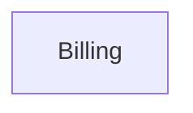

# Context Map

## Global View

## Bounded Contexts

### Billing

- **Core responsibility:** Own Invoice settlement eligibility and outcome.
- **Business authority:** Invoice identity and settlement state.
- **Model:** [Billing](context/billing/model.md)

## Model Dependency Contracts

None.
