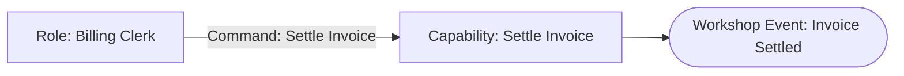

# Settle Invoice

## Scope and Exclusions

Billing accepts or rejects one payment against one Invoice. Provider delivery,
storage acknowledgement, retries, and reporting are excluded.

## EventStorming Model

## Decisions and Reasons

Invoice settlement is established by the Domain decision. No separate business
fact records that storage later acknowledged that decision.

## Affected Models

- [Billing](../context/billing/model.md)

## Assumptions and Hotspots

None.
