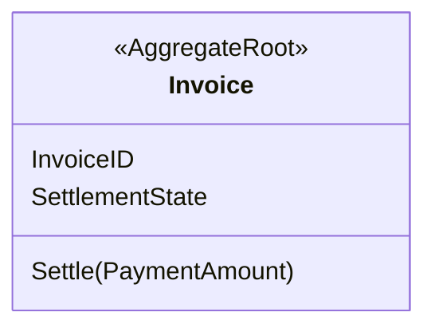
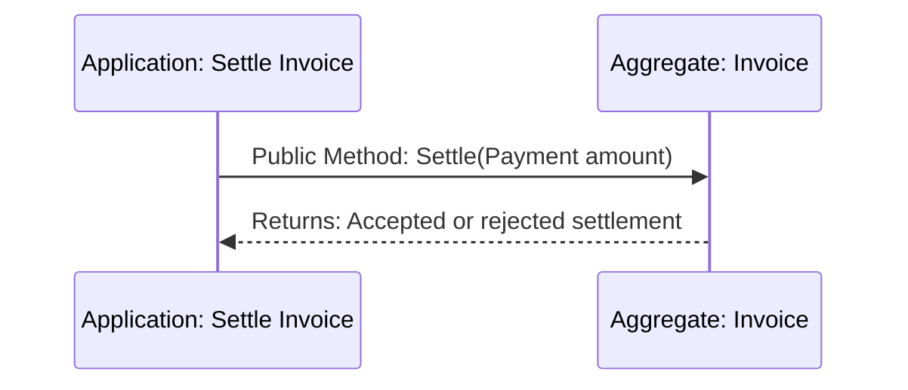

# Remove Persistence Confirmation Tactical Design

## Scope and Authority

The [Settle Invoice](../event-storming/settle-invoice.md) facts and
[Billing Model](../context/billing/model.md) govern this reversible exploration.
The Design Delta is removal of a persistence-derived responsibility currently
embedded in Invoice.

## Domain Responsibility Thesis

Invoice owns identity, settlement eligibility, and settlement state. It does not
own a second acknowledgement that technical storage completed.

| Domain object | Identity and lifecycle | Owned facts, rules, and change reasons | Semantic result | Boundary reason |
|---|---|---|---|---|
| Invoice | Invoice ID; unsettled to settled | Settlement eligibility and state | Accepted or rejected settlement | These facts change together under one invariant |

## State Authority and Semantic Flow

| Material fact/state | Business owner | Live runtime authority | Durable checkpoint or external authority | Validity after failure |
|---|---|---|---|---|
| Settlement state | Invoice | Current Invoice instance | Optional persistence of the same state | Persistence failure creates no new Invoice fact |

| Flow | Producer | Semantic result | Consumer | Business sequencer | Technical executor |
|---|---|---|---|---|---|
| Settle Invoice | Invoice | Accepted or rejected settlement | Calling use case | Invoice decides on Settle | Persistence adapter may store resulting state |

## Necessity Proof

| Proposed concept | Confirmed responsibility or guarantee it enables | Consequence of removal |
|---|---|---|
| Invoice settlement state | Invoice eligibility and lifecycle | The accepted settlement could not be represented |

The existing persistence-confirmation flag and methods enable no confirmed
responsibility or guarantee. They fail the necessity test and are outside the
candidate rather than renamed.

## Critical Collaboration Sequences

## Ownership and Changed Interfaces

Invoice retains only business settlement behavior. Technical persistence may
store Invoice state but cannot add a Domain acknowledgement responsibility.

## Non-Goals and Codify Discretion

This exploration does not choose a Repository, transaction, or provider. Codify
may make the smallest code deletion that preserves settlement behavior.

## Decision and Alternative

Delete the persistence-confirmation field and methods. Renaming them to a
durability acknowledgement was rejected because it preserves the same
unsupported responsibility.
