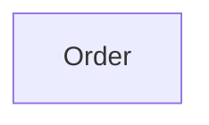

# Context Map

## Global View

Arrow direction: `U -> D` (Upstream -> Downstream).

## Bounded Contexts

### Order

- **Core responsibility:** Own customer orders.
- **Business authority:** Order lifecycle and order-line invariants.
