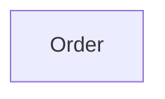

# Context Map

## Global View

Arrow direction: `U -> D` (Upstream -> Downstream).

## Bounded Contexts

### Order

- **Core responsibility:** Own the order lifecycle.
- **Business authority:** Order state and cancellation decisions.
