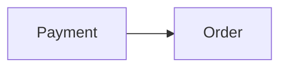

# Context Map

## Global View

Arrow direction: `U -> D` (Upstream model/published-contract influence -> Downstream model). It does not describe runtime call flow.



## Bounded Contexts

### Payment

- **Core responsibility:** Own payment processing and its business outcomes.
- **Business authority:** Payment lifecycle and payment outcome facts.

#### Local View

```text
+---------+   +-------+
| Payment |-->| Order |
+---------+   +-------+
```

#### Downstream Contracts

##### Payment Outcome Facts

- **Downstream:** Order
- **Published meaning:** Payment publishes authoritative payment outcomes.
- **Guarantee:** Payment owns outcome meaning and publication.

### Order

- **Core responsibility:** Own customer orders and fulfillment readiness.
- **Business authority:** Order lifecycle and the decision to begin fulfillment.

#### Local View

```text
+---------+   +-------+
| Payment |-->| Order |
+---------+   +-------+
```

#### Upstream Dependencies

##### Payment Outcome Facts

- **Upstream:** Payment
- **Accepted meaning:** Order accepts published payment outcomes as external facts.
- **Local translation:** Order translates them into fulfillment eligibility.
