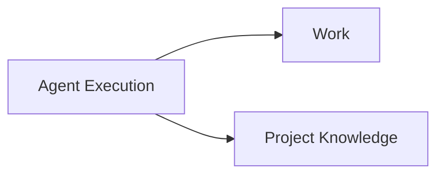

# Context Map

## Global View

Arrow direction: `U -> D` (Upstream -> Downstream).

## Bounded Contexts

### Agent Execution

- **Core responsibility:** Execute Agents and govern Agent Run lifecycle.
- **Business authority:** Agent Run admission, identity, lifecycle, and terminal outcome.

### Work

- **Core responsibility:** Govern Work and its business lifecycle.
- **Business authority:** Work lifecycle and completion.

### Project Knowledge

- **Core responsibility:** Govern canonical project knowledge and Candidate evaluation.
- **Business authority:** Knowledge Candidate evaluation and acceptance.

## Relationships

### Agent Execution -> Work

- **Relationship:** Customer-Supplier.
- **Authority boundary:** Agent Execution owns Agent Run outcomes; Work owns Work completion.
- **Translation boundary:** Work interprets execution results without importing runtime state.

### Agent Execution -> Project Knowledge

- **Relationship:** Customer-Supplier.
- **Authority boundary:** Agent Execution owns Agent Run outcomes; Project Knowledge owns Candidate acceptance.
- **Translation boundary:** Project Knowledge interprets execution results without importing runtime state.

### Work <-> Project Knowledge

- **Relationship:** Partnership.
- **Authority boundary:** Work and Project Knowledge exchange completion and Candidate facts.
- **Translation boundary:** Each side reacts in its own language.
