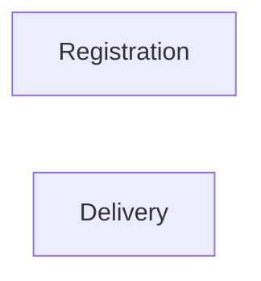

# Context Map

## Global View

Arrow direction: `U -> D` (Upstream model/published-contract influence -> Downstream model). It does not describe runtime call flow.



## Bounded Contexts

### Registration

- **Core responsibility:** Own attendee registration and seat allocation.
- **Business authority:** Seat commitment and release.

#### Local View

```text
+--------------+
| Registration |
+--------------+
```

### Delivery

- **Core responsibility:** Own workshop admission and delivery evidence.
- **Business authority:** Admission decisions, attendance, and no-show facts.

#### Local View

```text
+----------+
| Delivery |
+----------+
```
