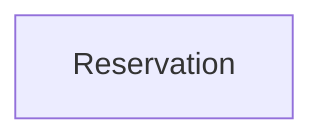

# Context Map

## Global View

Arrow direction: `U -> D` (Upstream model/published-contract influence -> Downstream model). It does not describe runtime call flow.



## Bounded Contexts

### Reservation

- **Core responsibility:** Govern reservation admission and outcomes.
- **Business authority:** Reservation owns its lifecycle outcomes.

#### Local View

```text
+-------------+
| Reservation |
+-------------+
```
