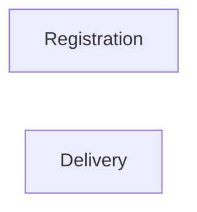

# Context Map

## Global View

Arrow direction: `U -> D` (Upstream -> Downstream).

## Bounded Contexts

### Registration

- **Core responsibility:** Own attendee registration and seat allocation.
- **Business authority:** Seat commitment and release.

### Delivery

- **Core responsibility:** Own workshop admission and delivery evidence.
- **Business authority:** Admission decisions, attendance, and no-show facts.
