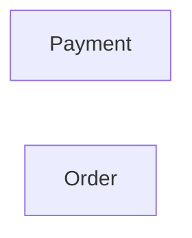

# Context Map

## Global View

Arrow direction: `U -> D` (Upstream model/published-contract influence -> Downstream model). It does not describe runtime call flow.

## Bounded Contexts

### Payment

- **Core responsibility:** Own payment processing and its business outcomes.
- **Business authority:** Payment lifecycle and payment outcome facts.

#### Local View

- No context dependencies.

### Order

- **Core responsibility:** Own customer orders and fulfillment readiness.
- **Business authority:** Order lifecycle and the decision to begin fulfillment.

#### Local View

- No context dependencies.
