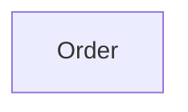

# Context Map

## Global View

Arrow direction: `U -> D` (Upstream model/published-contract influence -> Downstream model). It does not describe runtime call flow.



## Bounded Contexts

### Order

- **Core responsibility:** Own customer orders.
- **Business authority:** Order lifecycle and order-line invariants.

#### Local View

```text
+-------+
| Order |
+-------+
```
