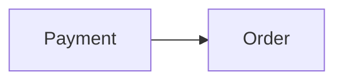

# Context Map

## Global View

Arrow direction: `U -> D` (Upstream -> Downstream).

## Bounded Contexts

### Order

- **Core responsibility:** Own the order lifecycle.
- **Business authority:** Order state and fulfillment decisions.

### Payment

- **Core responsibility:** Own payment settlement.
- **Business authority:** Payment attempt and settlement state.

## Relationships

### Payment -> Order

- **Relationship:** Published Language
- **Authority boundary:** Payment owns settlement facts; Order owns its reaction.
- **Translation boundary:** Order consumes `PaymentSucceeded` without importing Payment's internal model.
