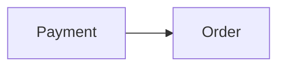

# Context Map

## Global View

Arrow direction: `U -> D` (Upstream model/published-contract influence -> Downstream model). It does not describe runtime call flow.

## Bounded Contexts

### Order

- **Core responsibility:** Own the order lifecycle.
- **Business authority:** Order state and fulfillment decisions.

#### Local View

- `Payment [U] -> Order`

#### Upstream Dependencies

##### Payment Succeeded Fact

- **Upstream:** Payment
- **Accepted meaning:** Order accepts the authoritative settlement outcome.
- **Local translation:** Order translates it into its own fulfillment decision.

### Payment

- **Core responsibility:** Own payment settlement.
- **Business authority:** Payment attempt and settlement state.

#### Local View

- `Payment -> Order [D]`

#### Downstream Contracts

##### Payment Succeeded Fact

- **Downstream:** Order
- **Published meaning:** Payment publishes its authoritative settlement outcome.
- **Guarantee:** Payment owns settlement meaning and publication.
