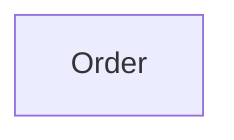

# Context Map

## Global View

Arrow direction: `U -> D` (Upstream -> Downstream).

## Bounded Contexts

### Order

- **Core responsibility:** Own customer orders and their fulfillment state.
- **Business authority:** Order lifecycle, payment status, and fulfillment eligibility.

## Relationships

Payment is an upstream external context. It publishes the stable Payment
Captured fact after settlement. Order consumes that fact through an
anti-corruption boundary and remains authoritative for the resulting order
state transition.
