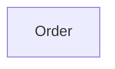

# Context Map

## Global View

Arrow direction: `U -> D` (Upstream model/published-contract influence -> Downstream model). It does not describe runtime call flow.

## Bounded Contexts

### Order

- **Core responsibility:** Own customer orders and their fulfillment state.
- **Business authority:** Order lifecycle, payment status, and fulfillment eligibility.

#### Local View

- No context dependencies.
