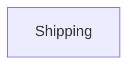

# Context Map

## Global View

Arrow direction: `U -> D` (Upstream model/published-contract influence -> Downstream model). It does not describe runtime call flow.

## Bounded Contexts

### Shipping

- **Core responsibility:** Own shipment dispatch and recipient notification intent.
- **Business authority:** Shipment lifecycle and notification timing.
- **Model:** [Shipping](context/shipping/model.md)

## Model Dependency Contracts
