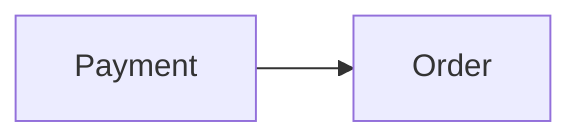

# Context Map

## Global View

Arrow direction: `U -> D` (Upstream model/published-contract influence -> Downstream model). It does not describe runtime call flow.




## Bounded Contexts

### Payment

- **Core responsibility:** Own payment settlement.
- **Business authority:** Payment capture outcomes.
- **Model:** [Payment](context/payment/model.md)

#### Local View

```text
+---------+   +-------+
| Payment |-->| Order |
+---------+   +-------+
```

### Order

- **Core responsibility:** Own order fulfillment.
- **Business authority:** Order readiness and fulfillment decisions.
- **Model:** [Order](context/order/model.md)

## Model Dependency Contracts

### Payment Captured Fact

- **Upstream:** Payment
- **Downstream:** Order
- **Published meaning:** Payment publishes the authoritative captured outcome.
- **Downstream reliance:** Order relies on Payment's captured outcome.
- **Local translation:** Order translates it into fulfillment eligibility.
- **Guarantee:** Payment owns capture meaning and publication.
