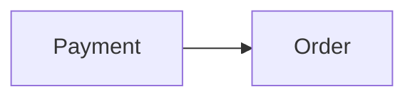

# Context Map

## Global View

Arrow direction: `U -> D` (Upstream model/published-contract influence -> Downstream model). It does not describe runtime call flow.



## Bounded Contexts

### Payment

- **Core responsibility:** Own payment settlement.
- **Business authority:** Payment capture outcomes.

#### Local View

```text
+---------+   +-------+
| Payment |-->| Order |
+---------+   +-------+
```

#### Downstream Contracts

##### Payment Captured Fact

- **Downstream:** Order
- **Published meaning:** Payment publishes the authoritative captured outcome.
- **Guarantee:** Payment owns capture meaning and publication.

### Order

- **Core responsibility:** Own order fulfillment.
- **Business authority:** Order readiness and fulfillment decisions.

#### Local View

```text
+---------+   +-------+
| Payment |-->| Order |
+---------+   +-------+
```

#### Upstream Dependencies

##### Payment Captured Fact

- **Upstream:** Payment
- **Accepted meaning:** Order accepts Payment's captured outcome.
- **Local translation:** Order translates it into fulfillment eligibility.
