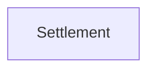

# Context Map

## Global View

Arrow direction: `U -> D` (Upstream model/published-contract influence -> Downstream model). It does not describe runtime call flow.

## Bounded Contexts

### Settlement

- **Core responsibility:** Settle account balances and establish completed settlements.
- **Business authority:** Account settlement eligibility and completion.
- **Model:** [Settlement](context/settlement/model.md)

## Model Dependency Contracts
