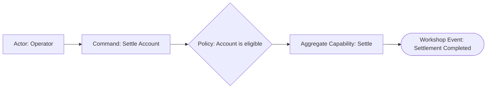

# Settle Account

## Scope and Exclusions

Settle one Account and announce durable completion. Provider delivery is outside scope.

## EventStorming Model

## Aggregate Capabilities

| Bounded Context | Aggregate Root | Source Command(s) | Capability | Required authoritative facts | Guaranteed business result | Stable rejection |
|---|---|---|---|---|---|---|
| Settlement | Account | Settle Account | Settle | Current balance and positive amount | Balance decreases and settlement is accepted | Insufficient balance or invalid amount leaves Account unchanged |

## Decisions and Reasons

The Account owns eligibility and balance transition. Completion means durable settlement.

## Affected Models

- [Settlement](../context/settlement/model.md)

## Assumptions and Hotspots

- None for the confirmed scope.
