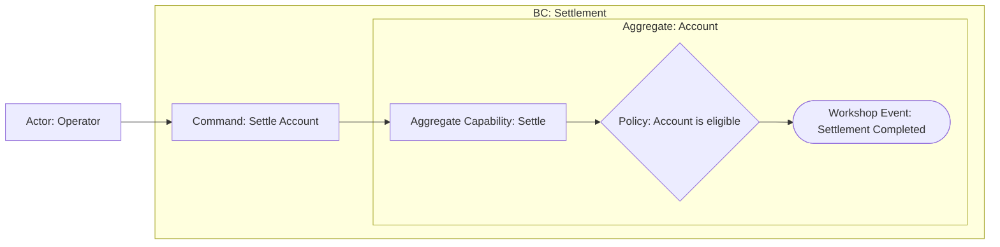

# Settle Account

## Scope and Exclusions

Settle one Account and announce durable completion. Provider delivery is outside scope.

## EventStorming Model

## Command-to-Capability Projection

| Bounded Context | Normalized Command | Aggregate Root or coordination owner | Aggregate Capability or explicit coordination |
|---|---|---|---|
| Settlement | Settle Account | Account | Settle |

## Decisions and Reasons

The Account owns eligibility and balance transition. Completion means durable settlement.

## Affected Models

- [Settlement](../context/settlement/model.md)

## Assumptions and Hotspots

- None for the confirmed scope.
