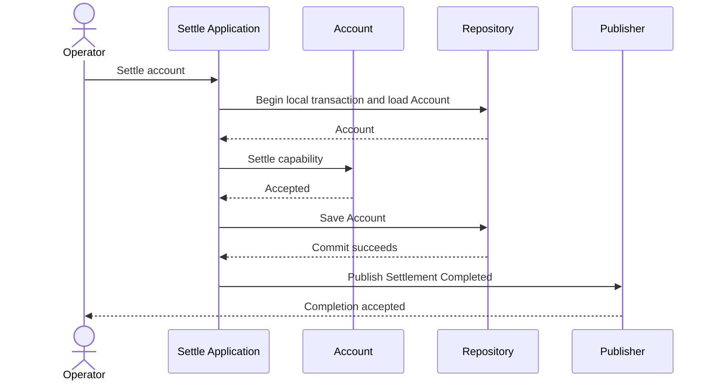

# Settle Account Publication Order Tactical Design

## Scope and Authority

Implements [Settle Account](../event-storming/settle-account.md) and the [Settlement Model](../context/settlement/model.md). Provider delivery policy is excluded.

## Critical Collaboration Sequences



```mermaid
sequenceDiagram
    actor Operator
    participant Application as Settle Application
    participant Account
    participant Repository
    participant Publisher
    Operator->>Application: Settle account
    Application->>Repository: Begin local transaction and load Account
    alt Load fails
        Repository-->>Application: Load failure
        Application-->>Operator: Settlement incomplete; no publication
    else Load succeeds
        Repository-->>Application: Account
        Application->>Account: Settle capability
        alt Domain rejects
            Account-->>Application: Rejected
            Application-->>Operator: Rejection; no publication
        else Domain accepts
            Account-->>Application: Accepted
            Application->>Repository: Save Account
            alt Save fails
                Repository-->>Application: Rollback
                Application-->>Operator: Settlement incomplete; no publication
            else Commit fails
                Repository-->>Application: Commit failure and rollback
                Application-->>Operator: Settlement incomplete; no publication
            else Commit succeeds
                Repository-->>Application: Committed
                Application->>Publisher: Publish Settlement Completed
                Application-->>Operator: Completion accepted
            end
        end
    end
```

## Ownership and Changed Interfaces

Application owns transaction orchestration and post-commit publication. Account remains transaction-unaware.

## Tactical Design Claims

| Claim ID | Responsibility | Accepted assertion |
|---|---|---|
| <a id="TD-001"></a>TD-001 | Application | Application publishes Settlement Completed only after the local transaction commits; any load, Domain, save, or commit failure publishes nothing. |

## Non-Goals

- Provider retry and delivery topology.

## Codify Discretion

- Concrete transaction and publisher adapter types inside the accepted semantic seams.

## Decisions and Reasons

Post-commit publication prevents announcing a settlement that did not become durable.
