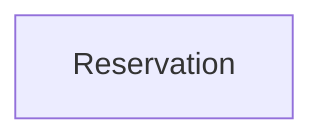

# Context Map

## Global View

Arrow direction: `U -> D` (Upstream model/published-contract influence -> Downstream model). It does not describe runtime call flow.

## Bounded Contexts

### Reservation

- **Core responsibility:** Reserve a limited resource for a customer.
- **Business authority:** Reservation identity, eligibility, and outcome.

#### Local View

- No context dependencies.
