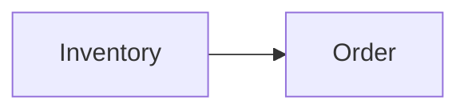

# Context Map

## Global View

Arrow direction: `U -> D` (Upstream model/published-contract influence -> Downstream model). It does not describe runtime call flow.

## Bounded Contexts

### Inventory

- **Core responsibility:** Reserve and release sellable stock.
- **Business authority:** Reservation admission, accepted quantity, and reservation state.

#### Local View

- `Inventory -> Order [D]`

#### Downstream Contracts

##### Inventory Reservation Outcome

- **Downstream:** Order
- **Published meaning:** Inventory publishes authoritative reservation outcomes.
- **Guarantee:** Inventory owns reservation meaning and publication.

### Order

- **Core responsibility:** Accept and track customer orders.
- **Business authority:** Order acceptance and fulfillment intent.

#### Local View

- `Inventory [U] -> Order`

#### Upstream Dependencies

##### Inventory Reservation Outcome

- **Upstream:** Inventory
- **Accepted meaning:** Order accepts authoritative reservation outcomes.
- **Local translation:** Order translates the outcome into fulfillment intent.
