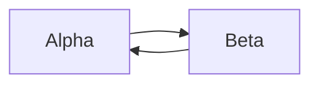

# Context Map

## Global View

Arrow direction: `U -> D` (Upstream model/published-contract influence -> Downstream model). It does not describe runtime call flow.

## Bounded Contexts

### Alpha

- **Core responsibility:** Own Alpha decisions.
- **Business authority:** Alpha facts.

#### Local View

- `Beta [U] -> Alpha`
- `Alpha -> Beta [D]`

#### Upstream Dependencies

##### Beta Facts

- **Upstream:** Beta
- **Accepted meaning:** Alpha accepts Beta facts.
- **Local translation:** Alpha translates them into Alpha language.

#### Downstream Contracts

##### Alpha Facts

- **Downstream:** Beta
- **Published meaning:** Alpha publishes Alpha facts.
- **Guarantee:** Alpha owns their meaning.

### Beta

- **Core responsibility:** Own Beta decisions.
- **Business authority:** Beta facts.

#### Local View

- `Alpha [U] -> Beta`
- `Beta -> Alpha [D]`

#### Upstream Dependencies

##### Alpha Facts

- **Upstream:** Alpha
- **Accepted meaning:** Beta accepts Alpha facts.
- **Local translation:** Beta translates them into Beta language.

#### Downstream Contracts

##### Beta Facts

- **Downstream:** Alpha
- **Published meaning:** Beta publishes Beta facts.
- **Guarantee:** Beta owns their meaning.
