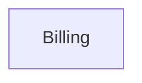

# Context Map

## Global View

Arrow direction: `U -> D` (Upstream model/published-contract influence -> Downstream model). It does not describe runtime call flow.

## Bounded Contexts

### Billing

- **Core responsibility:** Settle invoices and establish durable settlement.
- **Business authority:** Invoice settlement eligibility and balance transition.
- **Model:** [Billing](context/billing/model.md)

## Model Dependency Contracts
