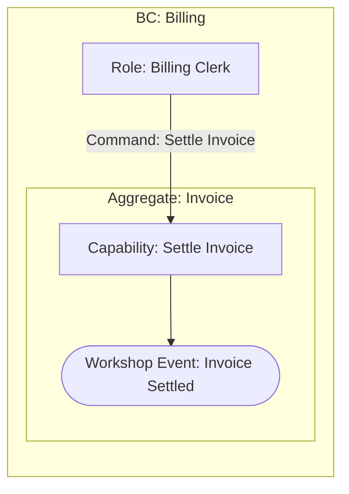

# Settle Invoice

## Scope and Exclusions

Settle one Invoice using an authoritative conversion rate when the payment uses a foreign currency. Persistence, provider protocol, and partial payments are outside scope.

## EventStorming Model

## Decisions and Reasons

The Invoice owns settlement eligibility and balance transition. It determines when an eligible foreign-currency attempt requires the rate owned by the Settlement Rate Authority. Provider mechanics do not own this business timing.

## Affected Models

- [Billing](../context/billing/model.md)

## Assumptions and Hotspots

- None for the confirmed scope.
