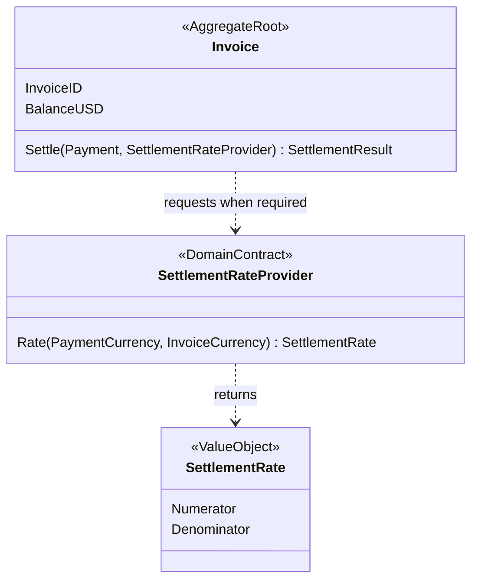
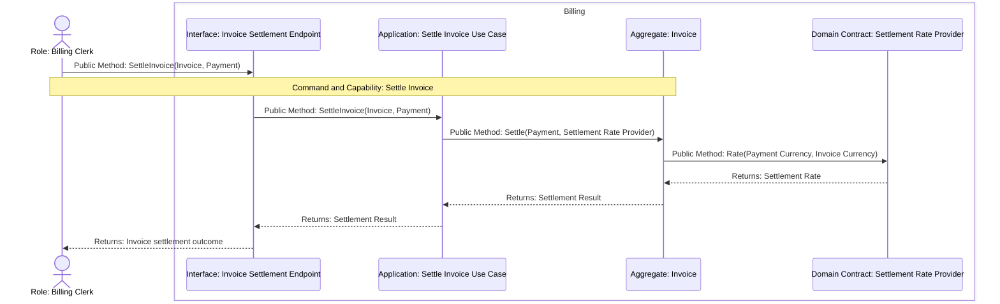

# Settlement Rate Ownership Tactical Design

## Scope and Authority

Implements [Settle Invoice](../event-storming/settle-invoice.md) and the [Billing Model](../context/billing/model.md). The confirmed Invoice decides whether an eligible foreign-currency attempt needs the authoritative Settlement Rate. Persistence, provider protocol, and partial payments are excluded. The Design Delta is ownership of the semantic rate contract and its call timing.

## Domain Responsibility Thesis

Invoice owns settlement eligibility, the decision to request a rate, and its settlement state. Settlement Rate is a Value Object supplied through a Domain-owned contract. Billing Application supplies the contract implementation without moving the business timing outward.

| Domain object | Identity and lifecycle | Owned facts, rules, and change reasons | Semantic result | Boundary reason |
|---|---|---|---|---|
| Invoice | Invoice ID from issue through settlement | Local eligibility, remaining balance, and when conversion is required | Settlement Result | These facts determine the settlement decision together |
| Settlement Rate | Value for one currency pair and attempt | Authoritative conversion value | Converted payment amount | Keeps provider representation outside Invoice behavior |

## State Authority and Semantic Flow

| Material fact/state | Business owner | Live runtime authority | Durable checkpoint or external authority | Validity after failure |
|---|---|---|---|---|
| Invoice settlement state | Invoice | Current Invoice instance | Persistence is outside this Design Delta | A rejected attempt or rate error leaves the instance unchanged |
| Settlement Rate | Settlement Rate Authority | Settlement Rate Value Object for one attempt | External authority owns the source rate | It is not cached or promoted to Invoice state by this design |

| Flow | Producer | Semantic result | Consumer | Business sequencer | Technical executor |
|---|---|---|---|---|---|
| Foreign-currency settlement | Settlement Rate Authority through the Domain contract | Settlement Rate | Invoice | Invoice decides after local eligibility that conversion is required | Application supplies the contract implementation; Infrastructure may adapt a provider |

## Necessity Proof

| Proposed concept | Confirmed responsibility or guarantee it enables | Consequence of removal |
|---|---|---|
| Domain-owned SettlementRateProvider | Lets Invoice obtain the externally authoritative value exactly when its settlement rule requires conversion | Application would have to decide when conversion is required and would own part of Invoice eligibility |
| Settlement Rate Value Object | Carries the authoritative conversion without provider or SDK vocabulary | Provider representation would leak into Invoice behavior |

## Critical Collaboration Sequences

## Ownership and Changed Interfaces

Billing Domain owns `SettlementRateProvider` because Invoice owns the business condition and timing for requesting a rate. Billing Application supplies its implementation and delegates the full settlement decision to Invoice. The provider-neutral `SettlementRate` keeps Infrastructure representation outside Domain behavior.

## Tactical Design Claims

| Claim ID | Responsibility | Reconciled assertion |
|---|---|---|
| TD-001 | Domain | Billing Domain owns the SettlementRateProvider contract, and Invoice decides when an eligible foreign-currency attempt invokes it; Application supplies the implementation without duplicating the contract. |
| TD-002 | Domain | SettlementRate carries the provider-neutral conversion value used by Invoice without SDK, protocol, cache, or provider identity. |

## BC Architecture Projection

| Source claim | Disposition | Bounded Context | Action | Decision ID | Current decision or iteration-only reason |
|---|---|---|---|---|---|
| [TD-001](#TD-001) | projected | Billing | add | ARCH-001 | Billing Domain owns the SettlementRateProvider contract and Invoice owns its call timing; Application supplies the implementation. |
| [TD-002](#TD-002) | iteration-only | — | — | — | The value is required in this implementation, but its numerator/denominator representation does not constrain future Billing architecture. |

## Reconciliation Evidence

`internal/billing/domain/invoice.go` defines the Domain-owned `SettlementRateProvider`, maps its result into a provider-neutral `SettlementRate`, and has Invoice invoke it only after local eligibility requires conversion. `internal/billing/application/settle_invoice.go` supplies that Domain contract to Invoice without defining an Application duplicate. `internal/billing/application/settle_invoice_test.go` verifies that an invalid foreign-currency payment makes zero rate calls and that an eligible attempt makes exactly one call and applies the returned rate. `go test ./...` passes. The implementation confirmed the candidate without a transaction, checkpoint, event, or recovery mechanism.

## Non-Goals and Codify Discretion

Persistence, provider protocol, caching, retry, partial payment, and transport encoding are excluded. Codify retains discretion over the Infrastructure adapter and provider configuration inside the accepted ownership seam.

## Decision and Alternative

Keeping the rate contract and call timing in Domain preserves Invoice's complete settlement rule while Application supplies execution. An Application-owned rate port and precomputed converted amount were rejected because they would move the decision about when conversion is required out of Invoice.
