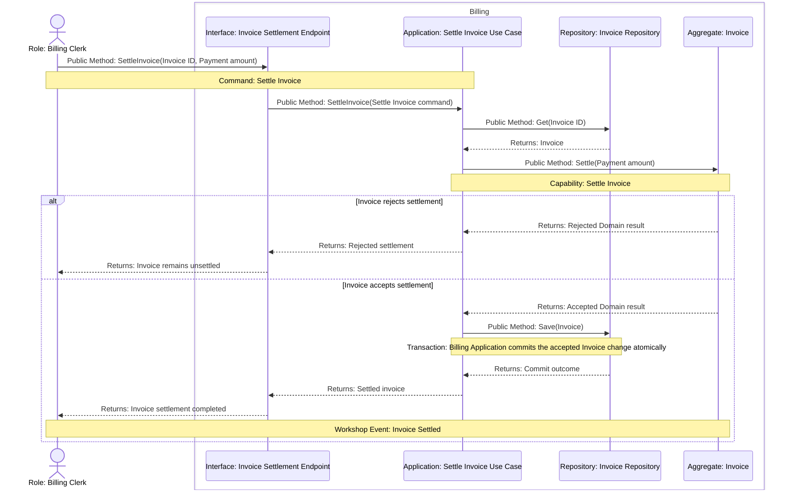

# Settle Invoice Atomicity Tactical Design

## Scope and Authority

Implements [Settle Invoice](../event-storming/settle-invoice.md) and the [Billing Model](../context/billing/model.md). Provider collection and partial payments are excluded. The Design Delta is ownership of the transaction that makes an accepted Invoice settlement durable.

## Critical Collaboration Sequences

## Ownership and Changed Interfaces

Billing Application owns the transaction around load, accepted Aggregate change, and save. Invoice owns settlement eligibility and remains transaction-unaware. The existing Interface maps the semantic accepted or rejected result without owning settlement rules. A persistence failure returns failure and leaves no durable settlement.

## Tactical Design Claims

| Claim ID | Responsibility | Accepted assertion |
|---|---|---|
| TD-001 | Application | Billing Application owns one transaction in which an accepted Invoice settlement is saved; a persistence failure commits no settled state. |
| TD-002 | Interface | The settlement Interface returns the Application's accepted or rejected semantic result without deciding Invoice eligibility. |

## BC Architecture Projection

| Source claim | Disposition | Bounded Context | Action | Decision ID | Current BC-specific architecture decision or iteration-only reason |
|---|---|---|---|---|---|
| [TD-001](#TD-001) | projected | Billing | add | ARCH-001 | Billing Application owns the transaction that atomically persists an accepted Invoice settlement; persistence failure leaves no settled state. |
| [TD-002](#TD-002) | iteration-only | — | — | — | This claim constrains the current delivery mapping but introduces no new durable Billing seam beyond the established Interface-to-Application boundary. |

## Non-Goals

- Provider collection, retries, partial payments, and a distributed transaction.

## Codify Discretion

- Transaction helper, Repository implementation, and transport result encoding inside the accepted semantic seams.

## Decisions and Reasons

Application-owned atomic persistence keeps the Domain transaction-unaware. Letting the Repository commit independently was rejected because it could make the externally successful result diverge from durable Invoice state. No ADR update is required.
