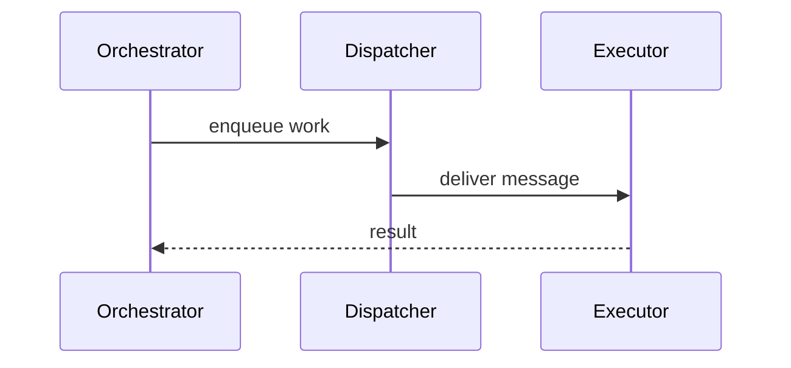

# Architecture

## Pattern Overview

**Overall:** DDD services with async runtime coordination.

## System Context

**Actors:**
- Developers

**External Systems:**
- Kubernetes
- Message bus

## Layering

The platform has orchestrator, dispatcher, and executor services.

**Call direction rules:**
- Services call request/response APIs downward and publish messages for cross-context reactions.

## Scenario Sequences

### Execute Work

