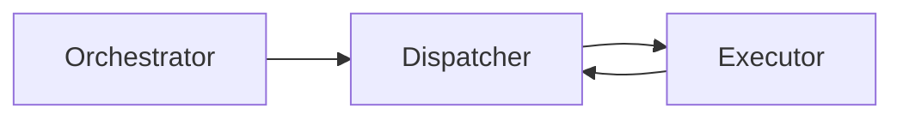
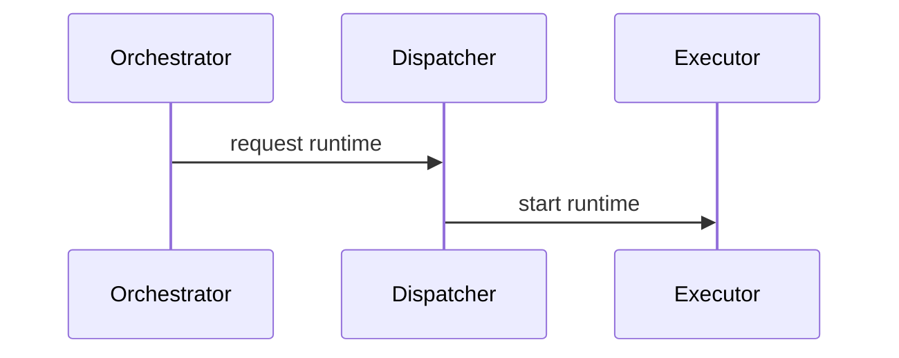
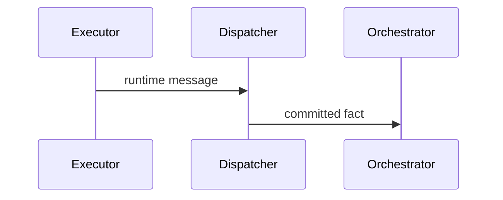
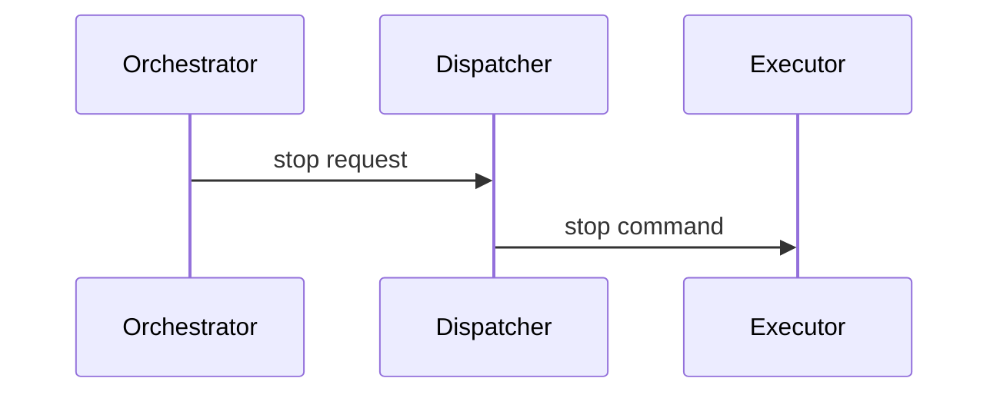
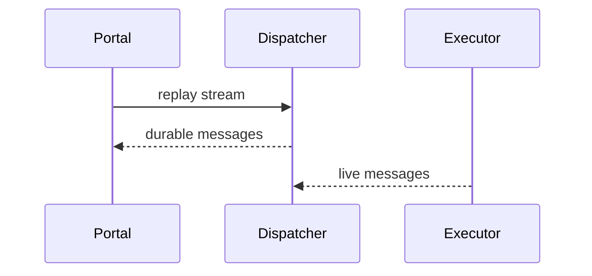
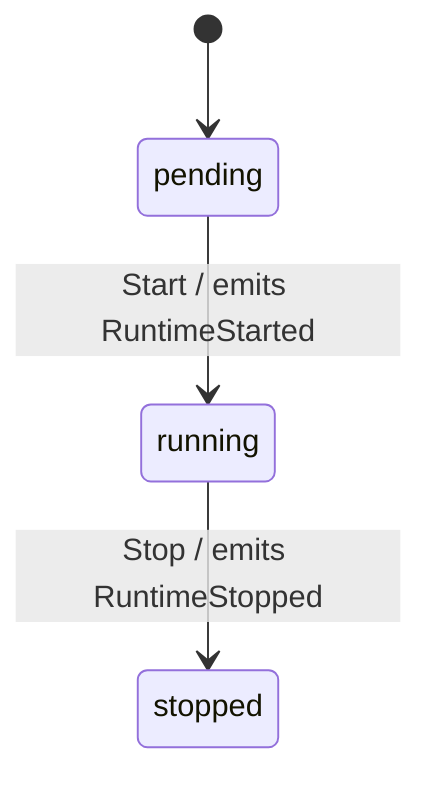

# Architecture

## Pattern Overview

**Overall:** DDD services with async runtime coordination.

## System Context

**Actors:**
- Developers

**External Systems:**
- Kubernetes
- Message bus

## System Topology / Context Map

**Call direction rules:**
- Services call request/response APIs downward and publish messages for cross-context reactions.

## Service Architecture Cards

#### Orchestrator
**Responsibility:** Owns cross-task orchestration signals and decisions.
**Path / entry:** `cmd/orchestrator/` -> `internal/orchestrator/`
**Internal layers / components:** `domain`, `application`, `infrastructure`.
**Interactions:** Consumes intent events and calls Dispatcher/Work APIs.
**State / invariants:** Decisions are idempotent.
**Source refs:** `cmd/orchestrator/`, `internal/orchestrator/`, `api/orchestrator/v1/orchestrator.proto`.

#### Dispatcher
**Responsibility:** Owns runtime stream routing and durable message append.
**Path / entry:** `cmd/dispatcher/` -> `internal/dispatcher/`
**Internal layers / components:** `domain`, `application`, `infrastructure`.
**Interactions:** Receives Executor streams and publishes runtime events.
**State / invariants:** Durable append precedes live publish.
**Source refs:** `cmd/dispatcher/`, `internal/dispatcher/`, `api/dispatcher/v1/dispatcher.proto`.

#### Executor
**Responsibility:** Runs the runtime process and connects outward to Dispatcher.
**Path / entry:** `cmd/executor/` -> `internal/executor/`
**Internal layers / components:** `domain`, `application`, `infrastructure`.
**Interactions:** Receives Dispatcher commands and emits runtime messages.
**State / invariants:** Executor has no inbound API.
**Source refs:** `cmd/executor/`, `api/executor/v1/executor.proto`.

## Scenario Sequences

### Start Runtime

### Deliver Runtime Message

### Stop Runtime

### Replay Runtime

## Key Object FSMs

