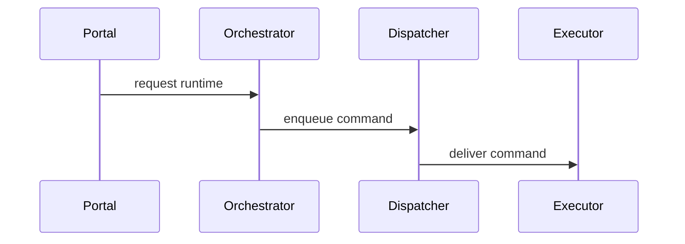

# Architecture: Runtime Message Chain

## Purpose

Portal starts a runtime path that eventually reaches Executor.

## Participants

- Portal
- Orchestrator
- Dispatcher
- Executor

## Sequence Phases

## Data Flow

- Runtime command moves from Portal to Orchestrator to Dispatcher to Executor.

## Source refs

- `cmd/orchestrator/`
- `cmd/dispatcher/`
- `cmd/executor/`
